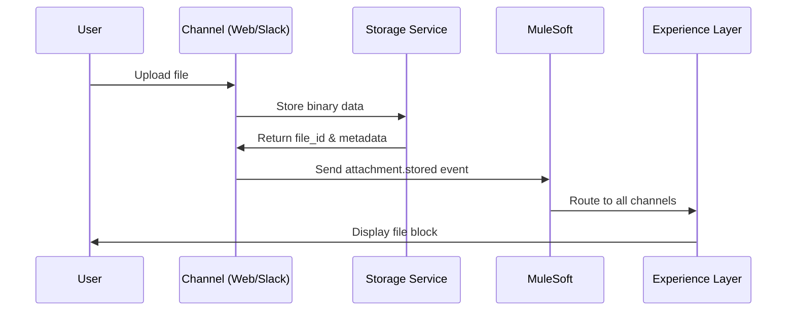

# Overview

## Purpose of the System

The **Chief Potential Officer System** is a modular, intelligent platform designed to enable natural language-driven user experiences. It integrates advanced language models with a flexible conversation and artifact interface to help users extract insights, automate workflows, and generate structured outputs. The system is internal to the organization and gated by secure Google-based authentication.

At its core, the system allows users to:

* Engage in threaded, contextual conversations with an AI assistant.
* Generate and manage structured artifacts (insights, reports, dashboards, etc.).
* Interact via a modular interface inspired by Slack's Block Kit.
* Maintain traceability, observability, and extensibility throughout.

## System Architecture Overview

The system is structured into two main layers with cross-cutting support systems:

### 1. **Experience Layer** (Frontend + Backend)

This is the primary user and integration surface, composed of:

* **Frontend**: A web-based UI that renders conversations and artifacts using a block-based design system. It supports Slack-like chat interfaces, card-based insight panels, and flexible layout rendering.
* **Backend**: The backend logic responsible for managing users, threads, messages, artifacts, and events. It exposes RESTful APIs (documented via Swagger/OpenAPI) to power the frontend.
* **Storage & Observability** (Experience-side): Responsible for persisting messages, threads, and artifacts; and tracking events, logs, and metrics for debugging and monitoring.

### 2. **Cognitive Services Layer**

This layer processes user input using language models and other intelligence tools. It is responsible for:

* Consuming conversational context (threads and messages)
* Generating assistant responses and structured insights
* Attaching relevant metadata (token usage, debug info, etc.)
* Returning responses to the Experience Layer in a consistent format
* **Storage & Observability** (Cognitive-side): Logs prompts, outputs, processing metrics, and model metadata to support traceability and performance optimization.

## High-Level Flow

1. User authenticates using Google OAuth.
2. User sends a message via the UI.
3. Experience Backend capture the message, associate it with a thread, and trigger cognitive processing.
4. Cognitive Services receive the message context and return a structured response (text + artifacts).
5. The UI renders the assistant response and associated artifacts.
6. All events are logged with metadata for observability.

## Design Principles

* **Unified Experience**: The Experience Layer brings frontend and backend logic together to ensure consistency and reliability.
* **Composable UI**: Built from reusable UI primitives for maximum design flexibility.
* **Contextual Intelligence**: Conversations are memory-aware and context-driven.
* **Modular & Extensible**: Easy to plug in new UI blocks, or backend services.
* **Secure by Default**: Google authentication and scoped access control.
* **Business-Logic-Less**: The Experience Layer contains no business logic; instead, it provides rich tools and capabilities to the Cognitive Services layer, which houses all decision-making and business intelligence.

## Key Capabilities

* Multi-turn, memory-aware conversations with LLM-powered assistant.
* Seamless integration of structured outputs ("artifacts") like insights, dashboards, and PDFs.
* Metadata and event tracking for every message and response.
* OpenAPI-documented services for fast onboarding and testing.
* Thread-based architecture for organized, contextual interactions.

# User Experience Flow

## Authentication and Access Control

* Users authenticate using **Google OAuth**.
* Upon login, the system verifies that the user's email belongs to the organization domain.
* Only verified internal users are allowed to proceed.
* The authenticated user session includes a unique `userId`, and optionally scoped permissions.

## Starting a Conversation

* Users interact via a **conversational UI** (chat interface).
* On initiating a new query:

  * The system either creates a **new thread** or continues an **existing thread** based on context.
  * A **message** is created and persisted with metadata: timestamp, user ID, thread ID, and message content.

## Backend Processing

* The Experience Backend:

  * Accepts the message via an API call.
  * Stores the message in association with a thread.
  * Emits an **event** to trigger downstream cognitive services.

## Cognitive Processing

* The Cognitive Services layer receives context:

  * Full or partial message history from the thread.
  * User ID and any relevant session or system metadata.
* It generates one or more:

  * Assistant messages (text)
  * Structured **artifacts** (insights, reports, dashboards)
  * Metadata (e.g. token usage, debug logs)

## Response Delivery

* The response is passed back to the Experience Backend.
* It creates a new **assistant message** in the thread.
* Artifacts are stored and linked to both the thread and the user.
* The UI updates in real time:

  * Assistant response is shown in the thread.
  * Artifacts appear in the Insight Panel.

## Metadata, Logging, and Observability

* Every interaction is logged with:

  * Timestamps
  * Token usage
  * Processing time
  * Service-specific tags (e.g. LLM engine used)
* These are stored for debugging, auditing, and usage analytics.

## User Experience Highlights

* Threaded, memory-aware conversation UX.
* Quick turnaround on insight generation and feedback.
* Seamless integration of chat, insights, and UI components.
* Secure and scoped to organizational members only.

# Conversation Architecture

## Threads

A **thread** represents a conversation session between a user and the assistant. It provides the contextual container for all related messages and artifacts.

### Purpose:

* Maintain continuity across multi-turn conversations.
* Serve as the contextual scope for assistant responses.
* Anchor all generated artifacts and assistant actions.

### Schema Fields:

* `threadId`: Unique identifier for the thread
* `userId`: User ID who created the thread (Experience system ID)
* `title` (optional): A human-readable summary/title for UI display
* `messages`: Ordered list of message objects associated with the thread
* `ts`: Timestamp of thread creation, formatted as a string
* `trashed`: Boolean indicating if the thread has been deleted
* `metadata` (optional): Object where cognitive services can store all context needed regarding the thread
  * `totalTokensUsed`: Cumulative tokens consumed across all messages in the thread
  * `primaryModel`: Most frequently used LLM model in this thread
  * `averageProcessingTime`: Average response time across all assistant messages
  * `threadSummary`: Auto-generated summary of the conversation
  * `topics`: Array of key topics discussed in the thread
  * `artifacts`: Array of all artifact IDs created within this thread
  * `userIntent`: Classified intent or goal of the conversation
  * `conversationStage`: Current stage of the conversation (e.g., "discovery", "analysis", "conclusion")
  * `tags`: User or system-assigned tags for categorization
  * `priority`: Thread priority level (e.g., "low", "medium", "high")
  * `channelMapping`: Slack channel association information
  * `lastActivity`: Timestamp of the last user or assistant activity
  * `debug`: Thread-level debugging and diagnostic information 

## Messages

A **message** is a single entry in a conversation, either authored by the user or the assistant.

### Schema Fields:

* `type`: Indicates the type of object (always "message" for all message types)
* `subtype` (optional): Specifies the message subtype (e.g., "channel_join", "bot_message", "channel_leave", etc.)
* `channel`: Slack channel ID where the message is posted
* `user`: Slack user ID of the message sender
* `text`: The content of the message
* `ts`: Unique timestamp identifier for the message
* `threadId`: Associates the message with a specific thread in the Experience system
* `userId`: Maps the Slack user to the Experience system's user ID
* `username` (optional): The display name or username of the message author/sender
* `edited` (optional): Object containing edit information when the message has been modified
  * `user`: Slack user ID of who edited the message
  * `ts`: Timestamp when the message was edited
* `hidden` (optional): Boolean indicating if the message should not be displayed to users
* `deleted_ts` (optional): Timestamp of the original message if this is a deletion record
* `event_ts` (optional): Timestamp when the event occurred
* `attachments` (optional): Array of attachment objects
* `is_starred` (optional): Boolean indicating if the message is starred by the calling user
* `reactions` (optional): Array of reaction objects
  * `name`: Name of the reaction emoji
  * `count`: Total count of users who reacted
  * `users`: Array of user IDs who reacted (may be incomplete for large counts)
* `metadata` (optional): Object where cognitive services can store all context needed regarding the message, example:
  * `tokensUsed`: Number of tokens consumed in processing this message
  * `model`: LLM model used for generation (e.g., "gpt-4o", "claude-3")
  * `processingTime`: Time in milliseconds to generate the response
  * `confidence`: Confidence score for the response (0-1)
  * `sources`: Array of source references used in generating the response
  * `reasoning`: Brief explanation of the cognitive process used
  * `artifacts`: Array of artifact IDs created in response to this message
  * `debug`: Additional debugging information for troubleshooting

### Notes:

* Rich content (e.g. insights or dashboard summaries) is rendered using block components in the UI.

## Message Format

To ensure compatibility with Slack's message format while enabling sophisticated user experiences, the system adopts a dual-content approach for messages. Every message contains both a `text` field (for fallback/accessibility) and an optional `blocks` array (for rich, interactive experiences).

### Dual-Content Philosophy

* **`text` field**: Provides accessible, readable fallback content that works in any context - from screen readers to simple text-based clients. This is the "default" or "summary" version of the message content.

* **`blocks` array**: Enables sophisticated UI and UX through structured, interactive components that can render complex layouts, visualizations, and actionable elements.

This approach ensures that every message is accessible while providing rich experiences where supported.

### Complete Message Structure Example

```json
{
  "type": "message",
  "subtype": "bot_message",
  "channel": "C123ABC456",
  "user": "U123ABC456",
  "username": "assistant-bot",
  "text": "Market analysis complete! Southeast Asia shows $2.4B potential with 87% confidence. Key metrics: 6-12 month timeline, $1.2M investment required. View full analysis and schedule review meeting.",
  "blocks": [
    {
      "type": "section",
      "text": {
        "type": "mrkdwn",
        "text": "*Market Analysis Complete* :chart_with_upwards_trend:\n\nBased on your uploaded report, here are the key findings:"
      }
    },
    {
      "type": "divider"
    },
    {
      "type": "section",
      "fields": [
        {
          "type": "mrkdwn",
          "text": "*Market Size:*\n$2.4B potential"
        },
        {
          "type": "mrkdwn", 
          "text": "*Confidence Level:*\n87% (High)"
        },
        {
          "type": "mrkdwn",
          "text": "*Timeline:*\n6-12 months"
        },
        {
          "type": "mrkdwn",
          "text": "*Investment:*\n$1.2M initial"
        }
      ]
    },
    {
      "type": "actions",
      "elements": [
        {
          "type": "button",
          "text": {
            "type": "plain_text",
            "text": "View Full Analysis"
          },
          "style": "primary",
          "action_id": "view_analysis",
          "url": "https://experience.rpotential.dev/artifacts/market_analysis_001"
        }
      ]
    }
  ],
  "ts": "1355517523.000005",
  "threadId": "1231232132",
  "userId": "ExperienceID",
  "attachments": [],
  "reactions": [
    {
      "name": "thumbsup",
      "count": 3,
      "users": ["U1", "U2", "U3"]
    }
  ]
}
```

### Field Explanations:

* **`type`**: Always "message" for all message events (required)
* **`subtype`**: Optional field specifying the message subtype. Common Slack subtypes include:
  * `"bot_message"`: Message posted by an integration/bot
  * `"channel_join"`: User joined a channel
  * `"channel_leave"`: User left a channel  
  * `"channel_archive"`: Channel was archived
  * `"message_deleted"`: Message deletion record (hidden)
  * `"assistant_message"`: AI assistant response (Experience-specific)
* **`channel`**: Slack channel ID where the message is posted (required)
* **`user`**: Slack user ID of the message sender (required)
* **`text`**: **Fallback content** - The accessible, readable summary of the message that displays in simple clients, screen readers, notifications, and as a fallback when blocks cannot render. This should be comprehensive enough to convey the key information without the rich UI elements.
* **`blocks`** (optional): **Rich UI content** - Array of UI block objects that create sophisticated, interactive experiences. This is where the advanced UX lives - from simple formatting to complex insight cards, interactive buttons, and dynamic layouts. When present, this typically provides a much richer experience than the fallback text.
* **`ts`**: Unique timestamp identifier, acts as message ID (required)
* **`threadId`**: Experience system thread association (Experience-specific)
* **`userId`**: Maps Slack user to Experience system user ID (Experience-specific)
* **`username`**: Display name shown in UI (optional)
* **`edited`**: Present when message has been edited, contains editor ID and edit timestamp
* **`attachments`**: Array of rich content attachments (files, links, etc.)
* **`reactions`**: Array of emoji reactions with counts and user lists
* **`hidden`**: True for system messages that shouldn't be displayed (like edit/delete records)

### Content Strategy Guidelines

When creating messages, follow these patterns:

1. **Always include meaningful fallback text**: The `text` field should provide a complete, readable summary that conveys the essential information without any UI elements.

   ```json
   "text": "Revenue analysis shows 23% growth in Q4. Key drivers: expansion in APAC (8%), new product lines (10%), improved retention (5%). Full dashboard available with detailed breakdowns and forecasts."
   ```

2. **Use blocks for enhanced experiences**: The `blocks` array should provide value beyond the text through interactivity, structured layouts, visual elements, and actionable components.

   ```json
   "blocks": [
     {
       "type": "header",
       "text": {
         "type": "plain_text",
         "text": "📊 Q4 Revenue Growth Analysis"
       }
     },
     {
       "type": "section",
       "fields": [
         {"type": "mrkdwn", "text": "*Total Growth*\n23% ↗️"},
         {"type": "mrkdwn", "text": "*APAC Impact*\n8% increase"}
       ]
     },
     {
       "type": "actions",
       "elements": [
         {
           "type": "button",
           "text": {"type": "plain_text", "text": "View Dashboard"},
           "style": "primary",
           "url": "https://analytics.company.com/q4-revenue"
         }
       ]
     }
   ]
   ```

3. **Ensure consistency**: The blocks should enhance and expand upon the text content, not contradict it. Users should get the same core information from either format.

This format maintains full compatibility with Slack's message event structure while adding Experience-specific fields for thread association and enabling sophisticated user experiences through the UI blocks system.

## Text and Blocks: Fallback vs. Rich Experience

### The Dual-Content Pattern

Every message in the Experience Platform follows a "progressive enhancement" approach where content is delivered in two complementary formats:

1. **Text Field (Required)** - The fallback content that ensures accessibility and universal compatibility
2. **Blocks Array (Optional)** - The enhanced experience that provides rich, interactive functionality

### Why Both Are Essential

#### Text Field Benefits:
- **Universal Accessibility**: Works with screen readers, text-based clients, and assistive technologies
- **Notification Compatibility**: Displays properly in push notifications, email alerts, and mobile previews  
- **Cross-Platform Guarantee**: Ensures content is readable regardless of rendering capabilities
- **Search and Indexing**: Provides text content for search functionality and content indexing
- **Fallback Safety**: Guarantees message content is never lost due to rendering failures

#### Blocks Array Benefits:
- **Rich Visual Design**: Structured layouts, cards, charts, and visual hierarchies
- **Interactive Elements**: Buttons, forms, selects, and custom interactive components
- **Contextual Actions**: Task-specific actions and prompt suggestions directly embedded in content
- **Data Visualization**: KPIs, metrics, charts, and dashboard-style information displays
- **Enhanced User Experience**: Guided workflows and intuitive interaction patterns

### Implementation Examples

#### Example 1: Simple Insight Message

**Text (Fallback):**
```
Revenue increased 23% in Q4, driven by APAC expansion (8%) and new product lines (10%). View detailed analysis.
```

**Blocks (Rich Experience):**
```json
[
  {
    "type": "section",
    "text": {
      "type": "mrkdwn", 
      "text": "*Q4 Revenue Performance* :chart_with_upwards_trend:"
    }
  },
  {
    "type": "section",
    "fields": [
      {"type": "mrkdwn", "text": "*Total Growth*\n23% ↗️"},
      {"type": "mrkdwn", "text": "*APAC Impact*\n8% increase"}
    ]
  },
  {
    "type": "actions",
    "elements": [
      {
        "type": "button",
        "text": {"type": "plain_text", "text": "📊 View Analysis"},
        "style": "primary",
        "action_id": "view_revenue_analysis"
      }
    ]
  }
]
```

#### Example 2: Complex Market Analysis

**Text (Fallback):**
```
Market analysis complete for Southeast Asia opportunity. Key findings: $2.4B market size, 87% confidence level, 6-12 month entry timeline, $1.2M investment required. Major opportunities in fintech and e-commerce sectors. Competitive landscape shows 3 dominant players with room for disruption. Regulatory environment favorable with upcoming policy changes. Consumer readiness at 73% with strong demand for premium solutions. Full analysis with charts, projections, and action plan available.
```

**Blocks (Rich Experience):**
```json
[
  {
    "type": "header",
    "text": {"type": "plain_text", "text": "🎯 Southeast Asia Market Analysis"}
  },
  {
    "type": "section",
    "text": {
      "type": "mrkdwn",
      "text": "*Market Entry Opportunity Assessment*\nComprehensive analysis reveals significant untapped potential with favorable entry conditions"
    }
  },
  {
    "type": "context",
    "elements": [
      {
        "type": "mrkdwn",
        "text": "🏷️ Market Research • 🔴 High Priority • 🟢 Q2 2025"
      }
    ]
  },
  {
    "type": "divider"
  },
  {
    "type": "section",
    "text": {
      "type": "mrkdwn",
      "text": "*Key Performance Indicators:*"
    },
    "fields": [
      {"type": "mrkdwn", "text": "*Market Size*\n$2.4B ↗️"},
      {"type": "mrkdwn", "text": "*Confidence Level*\n87% ●"},
      {"type": "mrkdwn", "text": "*Entry Timeline*\n6-12 months"},
      {"type": "mrkdwn", "text": "*Investment Required*\n$1.2M"}
    ]
  },
  {
    "type": "section",
    "text": {
      "type": "mrkdwn",
      "text": "*Strategic Recommendations:*\n• Focus on fintech and e-commerce verticals\n• Establish partnerships with 2-3 local players\n• Phase market entry over 18 months\n• Prioritize regulatory compliance early"
    }
  },
  {
    "type": "actions",
    "elements": [
      {
        "type": "button",
        "text": {"type": "plain_text", "text": "📋 View Full Report"},
        "style": "primary",
        "url": "https://experience.rpotential.dev/reports/sea_analysis"
      },
      {
        "type": "button", 
        "text": {"type": "plain_text", "text": "📅 Schedule Review"},
        "action_id": "schedule_stakeholder_review"
      }
    ]
  },
  {
    "type": "context",
    "elements": [
      {
        "type": "mrkdwn",
        "text": "💬 _Ask: \"What are the regulatory requirements?\" or \"Analyze competitive responses\"_"
      }
    ]
  }
]
```

### Best Practices

1. **Text Should Stand Alone**: The fallback text must be comprehensive and informative without any reference to visual elements or interactive components.

2. **Blocks Should Add Value**: Don't just repeat the text in blocks - enhance it with structure, interactivity, and visual hierarchy.

3. **Maintain Information Parity**: Users should get the same essential information whether they see text or blocks, though the experience may be richer with blocks.

4. **Progressive Enhancement**: Start with clear, accessible text, then layer on enhanced experiences through blocks.

5. **Test Both Formats**: Ensure both text and blocks provide complete, satisfying user experiences independently.

This dual-content approach ensures the Experience Platform delivers sophisticated user experiences while maintaining universal accessibility and cross-platform compatibility.

## UI Blocks System

### Purpose and Philosophy

The UI Blocks system is the foundation of the Experience Platform's rich interface capabilities. While every message includes a `text` field that provides accessible fallback content, the real power lies in the `blocks` array, which enables sophisticated, interactive user experiences that can render consistently across multiple channels (Web, Slack, Email, Mobile).

**Key Principle**: The `text` field serves as the "fallback text" - a simple, readable version of the content that works in any context. The `blocks` array provides the enhanced, interactive version that creates engaging user experiences with structured layouts, visual elements, and actionable components.

### Block Architecture

All blocks share a common structure designed for extensibility and cross-channel compatibility:

```json
{
  "type": "block_type",
  "block_id": "optional_unique_id", 
  "v": 2,
  "platform_metadata": {
    "visibility": {
      "roles": ["user", "admin"],
      "conditions": ["thread_active", "user_authenticated"]
    },
    "analytics": {
      "track_interactions": true,
      "category": "insight_interaction"
    },
    "rendering": {
      "channel_overrides": {
        "slack": { "max_width": "300px" },
        "email": { "static_render": true }
      }
    }
  }
}
```

### Core Block Types

#### Standard Blocks (Slack Block Kit Compatible)

* **`section`**: Rich text content with optional structured fields and interactive accessories
* **`actions`**: Container for interactive elements like buttons and select menus  
* **`divider`**: Visual separator between content sections
* **`image`**: Inline media with accessibility support and optional titles
* **`context`**: Small auxiliary text and metadata displays
* **`header`**: Large, bold header text for section titles
* **`input`**: Form input elements for data collection
* **`file`**: References to uploaded files and attachments
* **`rich_text`**: Advanced formatting with inline styling elements

#### Experience-Specific Blocks (Future Planned)

These blocks are planned extensions to the platform's capabilities beyond standard messaging, all of these should have a Standard Blocks fallback mechanism.

* **`insight_card`**: Structured business intelligence displays with KPIs, tags, and actions
* **`insight_pile`**: Filterable collections of insights with navigation and sorting
* **`insight_details`**: Detailed insight views with comprehensive KPI dashboards
* **`navigation_rail`**: Collapsible sidebar navigation with nested menu items

*Note: Until these custom blocks are implemented, similar functionality can be achieved using combinations of standard Slack Block Kit components as shown in the examples below.*

### Interactive Elements

The system supports comprehensive interactive elements that can be embedded within action blocks:

#### Standard Elements
* **`button`**: Primary, secondary, and danger style buttons with URL and action support
* **`static_select`**: Single-selection dropdown menus with predefined options
* **`multi_static_select`**: Multi-selection menus for choosing multiple options
* **`datepicker`**: Date selection interface
* **`timepicker`**: Time selection interface

#### Experience-Specific Elements (Future Planned)
* **`prompt_chip`**: Suggested conversation starters with insight references

*Note: Until custom interactive elements are implemented, similar functionality can be achieved using standard buttons with descriptive text.*

```json
{
  "type": "actions",
  "elements": [
    {
      "type": "button",
      "text": {"type": "plain_text", "text": "View Analysis"},
      "style": "primary",
      "action_id": "view_detailed_analysis",
      "url": "https://experience.rpotential.dev/insights/market_analysis_001"
    },
    {
      "type": "button",
      "text": {"type": "plain_text", "text": "Ask About Risks"},
      "action_id": "chat_risks",
      "style": "default"
    }
  ]
}
```

### Cross-Channel Rendering

Blocks automatically adapt to different contexts while maintaining semantic meaning:

| Channel | Rendering Approach | Interactive Support | Fallback Behavior |
|---------|-------------------|-------------------|------------------|
| **Web** | Full interactive capability with all block types | Complete | Native block rendering |
| **Slack** | Native Block Kit rendering | Slack-supported elements only | Custom blocks → sections |
| **Email** | Static HTML rendering | CTAs become links | Interactive → static displays |
| **Mobile** | Responsive layouts optimized for touch | Touch-optimized elements | Adaptive sizing |

### Example: Comprehensive Assistant Response

Here's a real-world example showing how the `text` field provides fallback content while `blocks` create a rich experience:

```json
{
  "type": "message",
  "subtype": "assistant_message",
  "channel": "C123ABC456",
  "user": "UASSISTANT",
  "username": "AI Assistant",
  "text": "Market analysis complete! Key findings: Southeast Asia shows $2.4B potential with 87% confidence. Market entry timeline: 6-12 months requiring $1.2M investment. Full analysis and recommendations available.",
  "blocks": [
    {
      "type": "header",
      "text": {
        "type": "plain_text",
        "text": "🎯 Market Analysis Results"
      }
    },
    {
      "type": "section",
      "text": {
        "type": "mrkdwn",
        "text": "*Southeast Asia Market Entry Strategy*\nComprehensive analysis for Q2 2025 market entry opportunity"
      }
    },
    {
      "type": "context",
      "elements": [
        {
          "type": "mrkdwn",
          "text": "🏷️ Strategic Planning • Market Research • Southeast Asia"
        }
      ]
    },
    {
      "type": "divider"
    },
    {
      "type": "section",
      "text": {
        "type": "mrkdwn",
        "text": "*Executive Summary*\nAnalysis of the Southeast Asian market reveals a **$2.4B opportunity** with favorable conditions for Q2 2025 entry. Key success factors include strategic partnerships, localized product offerings, and phased market penetration."
      }
    },
    {
      "type": "section",
      "text": {
        "type": "mrkdwn",
        "text": "*Key Performance Indicators:*"
      },
      "fields": [
        {"type": "mrkdwn", "text": "*Revenue Potential*\n$2.4B (+15%) ↗️"},
        {"type": "mrkdwn", "text": "*Market Readiness*\n87% (+12%) ↗️"},
        {"type": "mrkdwn", "text": "*Investment Required*\n$1.2M ●"},
        {"type": "mrkdwn", "text": "*Time to Market*\n9 months ●"}
      ]
    },
    {
      "type": "section",
      "text": {
        "type": "mrkdwn",
        "text": "*Market Dynamics Analysis:*"
      },
      "fields": [
        {"type": "mrkdwn", "text": "*Market Size*\n$2.4B TAM"},
        {"type": "mrkdwn", "text": "*Growth Rate*\n23% CAGR"},
        {"type": "mrkdwn", "text": "*Competition*\n3 major players"},
        {"type": "mrkdwn", "text": "*Barriers*\nLow to moderate"}
      ]
    },
    {
      "type": "image",
      "image_url": "https://charts.company.com/sea_growth_projection.png",
      "alt_text": "Market Growth Projection chart showing 23% CAGR over 5 years",
      "title": {
        "type": "plain_text",
        "text": "Market Growth Projection"
      }
    },
    {
      "type": "actions",
      "elements": [
        {
          "type": "button",
          "text": {"type": "plain_text", "text": "📊 View Full Analysis"},
          "style": "primary",
          "action_id": "view_full_analysis",
          "url": "https://experience.rpotential.dev/artifacts/market_analysis_sea_001"
        },
        {
          "type": "button",
          "text": {"type": "plain_text", "text": "📋 Create Action Plan"},
          "action_id": "create_action_plan"
        },
        {
          "type": "button",
          "text": {"type": "plain_text", "text": "📅 Schedule Review"},
          "action_id": "schedule_stakeholder_review"
        }
      ]
    },
    {
      "type": "context",
      "elements": [
        {
          "type": "mrkdwn",
          "text": "💡 Analysis based on Q4 2024 market reports • Generated using GPT-4o • 1,247 tokens"
        }
      ]
    },
    {
      "type": "context",
      "elements": [
        {
          "type": "mrkdwn",
          "text": "💬 _Try asking: \"What are the regulatory requirements?\" or \"Analyze competitive responses\"_"
        }
      ]
    }
  ],
  "ts": "1704715200.000003",
  "threadId": "abc123",
  "userId": "user456",
  "metadata": {
    "tokensUsed": 1247,
    "model": "gpt-4o", 
    "processingTime": 2340,
    "confidence": 0.94,
    "artifacts": ["market_analysis_sea_001"],
    "sources": ["q4_market_report.pdf", "consumer_survey_2024.csv"]
  }
}
```

### Complex Layout Example: Insight Details

Here's how a detailed insight view would render using multiple block types:

```json
{
  "type": "message",
  "text": "Detailed analysis of Southeast Asia market opportunity with comprehensive metrics, trend analysis, and strategic recommendations.",
  "blocks": [
    {
      "type": "top_bar",
      "title": "Market Analysis Dashboard",
      "breadcrumbs": [
        {"text": "Home", "url": "/"},
        {"text": "Insights", "url": "/insights"},
        {"text": "Market Analysis", "action_id": "nav_market_analysis"}
      ],
      "actions": [
        {
          "type": "button",
          "text": {"type": "plain_text", "text": "Export PDF"},
          "action_id": "export_analysis_pdf"
        }
      ],
      "search": {
        "placeholder": "Search insights...",
        "action_id": "search_insights"
      }
    },
    {
      "type": "insight_details",
      "insight_id": "market_analysis_sea_001",
      "header": {
        "title": "Southeast Asia Market Entry Strategy",
        "subtitle": "Comprehensive analysis for Q2 2025 market entry opportunity",
        "breadcrumbs": [
          {"text": "Strategic Planning"},
          {"text": "Market Research"},
          {"text": "Southeast Asia"}
        ]
      },
      "content_sections": [
        {
          "title": "Executive Summary",
          "content": {
            "type": "mrkdwn",
            "text": "Analysis of the Southeast Asian market reveals a **$2.4B opportunity** with favorable conditions for Q2 2025 entry. Key success factors include strategic partnerships, localized product offerings, and phased market penetration."
          }
        },
        {
          "title": "Market Dynamics",
          "blocks": [
            {
              "type": "section",
              "fields": [
                {"type": "mrkdwn", "text": "*Market Size*\n$2.4B TAM"},
                {"type": "mrkdwn", "text": "*Growth Rate*\n23% CAGR"},
                {"type": "mrkdwn", "text": "*Competition*\n3 major players"},
                {"type": "mrkdwn", "text": "*Barriers*\nLow to moderate"}
              ]
            }
          ]
        }
      ],
      "kpi_dashboard": {
        "metrics": [
          {
            "label": "Revenue Potential",
            "value": "$2.4B",
            "change": "+15%",
            "trend": "up",
            "format": "currency"
          },
          {
            "label": "Market Readiness",
            "value": "87%",
            "change": "+12%", 
            "trend": "up",
            "format": "percentage"
          },
          {
            "label": "Investment Required",
            "value": "$1.2M",
            "trend": "stable",
            "format": "currency"
          },
          {
            "label": "Time to Market",
            "value": "9 months",
            "trend": "stable",
            "format": "text"
          }
        ],
        "charts": [
          {
            "title": "Market Growth Projection",
            "type": "line",
            "url": "https://charts.company.com/sea_growth_projection.png"
          },
          {
            "title": "Competitive Landscape",
            "type": "pie", 
            "url": "https://charts.company.com/sea_competition.png"
          }
        ]
      },
      "actions": [
        {
          "type": "button",
          "text": {"type": "plain_text", "text": "Create Action Plan"},
          "style": "primary",
          "action_id": "create_action_plan"
        },
        {
          "type": "button",
          "text": {"type": "plain_text", "text": "Schedule Presentation"},
          "action_id": "schedule_presentation"
        }
      ]
    },
    {
      "type": "actions",
      "elements": [
        {
          "type": "prompt_chip",
          "text": "What regulatory considerations should we review?",
          "action_id": "chat_regulatory_analysis"
        },
        {
          "type": "prompt_chip",
          "text": "Analyze competitive responses to market entry",
          "action_id": "chat_competitive_analysis"
        },
        {
          "type": "prompt_chip",
          "text": "Generate workforce expansion plan",
          "action_id": "chat_workforce_planning"
        }
      ]
    }
  ]
}
```

### Implementation Patterns

#### Progressive Enhancement
Always start with accessible fallback text, then enhance with blocks:

```json
{
  "text": "Revenue increased 23% in Q4 with strong performance in all regions.",
  "blocks": [
    {
      "type": "header",
      "text": {
        "type": "plain_text",
        "text": "📊 Q4 Revenue Performance"
      }
    },
    {
      "type": "section",
      "fields": [
        {"type": "mrkdwn", "text": "*Growth*\n23% ↗️"},
        {"type": "mrkdwn", "text": "*Revenue*\n$4.2M ↗️"}
      ]
    }
  ]
}
```

#### Responsive Design
Use platform metadata to optimize for different channels:

```json
{
  "type": "section",
  "text": {
    "type": "mrkdwn",
    "text": "*Revenue Analysis Dashboard*\nQ4 performance insights and projections"
  },
  "fields": [
    {"type": "mrkdwn", "text": "*Total Revenue*\n$4.2M"},
    {"type": "mrkdwn", "text": "*Growth Rate*\n23%"},
    {"type": "mrkdwn", "text": "*Top Region*\nAPAC (+35%)"}
  ],
  "platform_metadata": {
    "rendering": {
      "channel_overrides": {
        "mobile": {"layout": "vertical"},
        "web": {"layout": "grid"},
        "slack": {"max_fields": 4}
      }
    }
  }
}
```

#### Accessibility
Always include alt text, labels, and fallback content:

```json
{
  "type": "image",
  "image_url": "https://charts.company.com/revenue_trend.png", 
  "alt_text": "Revenue trend chart showing 23% growth over 4 quarters",
  "title": {
    "type": "plain_text",
    "text": "Q4 Revenue Growth Trend"
  }
}
```

This UI Blocks system enables the creation of sophisticated, interactive interfaces while maintaining compatibility with simple text-based clients through the always-present fallback text field.

## Assistant Roles and Behavior

* Assistants are stateless LLM-based agents with memory provided through thread context.
* Each assistant response is generated with full or scoped access to the message history.

## Metadata and Traceability

All messages and events are tracked with metadata that enables:

* Usage analytics (token counts, processing times)
* Model attribution (which engine, which prompt)
* Debug and replay mechanisms

# Cognitive Services Integration

## Purpose

The Cognitive Services layer is responsible for interpreting user messages, generating responses, and producing structured artifacts. It acts as the intelligence engine of the system, transforming context and input into meaningful outputs using a combination of language models and custom cognitive modules.

## Input Structure

When a user message is received, the Experience Backend constructs a structured payload and sends it to the Cognitive Services interface.

### Request Payload Example:

```json
{
  "threadId": "abc123",
  "userId": "user456",
  "messages": [
    {
      "type": "message",
      "subtype": "user_message",
      "channel": "C123ABC456",
      "user": "U123ABC456",
      "userId": "user456",
      "username": "john.doe",
      "text": "What are the top three insights from last week's report?",
      "ts": "1704715200.000001",
      "attachments": [
        {
          "id": "F123456789",
          "name": "weekly_report.pdf",
          "mimetype": "application/pdf",
          "url_private": "https://files.rpotential.dev/files-pri/T123-F123456789/weekly_report.pdf",
          "size": 1024000
        }
      ]
    },
    {
      "type": "message",
      "subtype": "assistant_message",
      "channel": "C123ABC456",
      "user": "UASSISTANT",
      "userId": "assistant-system",
      "username": "AI Assistant",
      "text": "I've analyzed the report. Here are my findings:",
      "ts": "1704715180.000002",
      "artifacts": [
        {
          "artifactId": "artifact_001",
          "type": "insight",
          "title": "Q4 Revenue Analysis",
          "url": "https://hub.rpotential.dev/artifacts/artifact_001"
        }
      ]
    }
  ],
  "artifacts": [
    {
      "artifactId": "artifact_001",
      "type": "insight",
      "threadId": "abc123",
      "title": "Q4 Revenue Analysis",
      "data": {
        "summary": "Revenue increased by 23% compared to Q3...",
        "charts": ["revenue_trend.png", "department_breakdown.png"]
      },
      "createdBy": "assistant-system",
      "createdAt": "2025-07-08T09:45:00Z"
    }
  ],
  "files": [
    {
      "fileId": "F123456789",
      "name": "weekly_report.pdf",
      "mimetype": "application/pdf",
      "size": 1024000,
      "uploadedBy": "user456",
      "uploadedAt": "2025-07-08T09:30:00Z",
      "url": "https://files.rpotential.dev/files-pri/T123-F123456789/weekly_report.pdf"
    }
  ],
  "threadMetadata": {
    "primaryModel": "gpt-4o",
    "threadSummary": "User requesting analysis of weekly report with focus on revenue insights",
    "topics": ["revenue analysis", "quarterly reports", "business insights"],
    "artifacts": ["artifact_001"],
    "userIntent": "data_analysis",
    "conversationStage": "analysis",
    "tags": ["finance", "weekly-review"],
    "priority": "medium",
    "channelMapping": {
      "slackChannel": "C123ABC456",
      "channelName": "finance-team"
    },
    "lastActivity": "2025-07-08T10:00:00Z"
  },
  "metadata": {
    "invocationId": "xyz789",
    "debug": true,
    "includeArtifacts": true,
    "includeFiles": true
  }
}
```

### Context Construction:

* Includes a limited message window for performance
* Appends system-level instructions (e.g., assistant identity, response format expectations)
* May include tool capabilities or function definitions

## Output Flow

The Cognitive Services layer does **not** directly respond to the frontend. Instead, it sends a new **assistant message** and optional **artifacts** to the Experience Backend, following the same contract used by the frontend.

### Assistant Message Submission

```json
{
  "type": "message",
  "threadId": "abc123",
  "senderId": "assistant-system",
  "senderRole": "assistant",
  "content": "Here are the top three insights...",
  "metadata": {
    "tokensUsed": 1345,
    "model": "gpt-4o",
    "durationMs": 820
  }
}
```

### Artifact Submission (if applicable)

```json
{
  "threadId": "abc123",
  "type": "artifact",
  "subtype": "insight",
  "title": "Revenue Growth",
  "data": { ... },
  "createdBy": "assistant-system"
}
```

This ensures that all communication—whether initiated by a user or by an assistant—is processed consistently through the Experience Backend.

## Responsibilities

* Interpret contextual history of the thread
* Generate coherent, contextually relevant responses
* Output structured artifacts that can be rendered in the UI
* Submit all outputs to the Experience Backend
* Provide traceability through metadata

## Observability

Cognitive Services record metadata for every request:

* Invocation and correlation IDs
* Timestamps and processing duration
* Token usage, model used
* Errors or warnings, if any

This data is logged and passed along with the messages and artifacts to support monitoring and debugging.

## Extensibility

The Cognitive Services layer is designed to be modular:

* Different skills (e.g., summarization, insight extraction, report generation) can be encapsulated as components.
* Multiple model backends can be supported and orchestrated.
* Tool or function-calling capabilities can be layered in at runtime.

# Artifact System

## Purpose

Artifacts are structured, persistent outputs generated by the assistant in response to user interactions. They provide value beyond the conversational thread by capturing insights, reports, dashboards, and other reusable content.

Artifacts can be created proactively by the assistant or manually by users and are designed to be presented as interactive elements within the user interface.

## Artifact Types

Artifacts are typed entities and can be rendered and processed differently based on their type. Example types include:

* `insight`: A structured analytical observation.
* `report`: A formal summary or synthesis of data.
* `pdf`: A reference to a downloadable PDF file.
* `dashboard`: A link or embedded snapshot to an analytics interface.
* `reference`: A file, link, or embedded resource related to user context.

## Artifact Schema

```json
{
  "type": "insight",
  "threadId": "abc123",
  "title": "Top Performing Campaigns",
  "data": {
    "summary": "Campaign X outperformed others by 35%...",
    "visual": "https://charts.example.com/render?id=xyz"
  },
  "createdBy": "assistant-system",
  "createdAt": "2025-07-08T10:01:12Z",
  "metadata": {
    "source": "report_analysis",
    "tokenUsage": 178
  }
}
```

## Association and Lifecycle

* Each artifact is always associated with a specific `threadId`.
* Artifacts are stored persistently and can be retrieved independently or alongside the thread.
* Artifacts may be linked from multiple messages or surfaced through panels outside of the conversation.
* Artifacts do not expire unless explicitly deleted or pruned by policy.

## UI Integration

Artifacts are surfaced to users through:

* **Inline cards** inside the conversational thread.
* **Artifact panels** or tabs within the interface.
* **Search and filtering tools** to find artifacts by type, title, or origin.

Artifacts are rendered using block-based UI primitives. Each type can define a default visual layout and interaction pattern.

## Submission and Routing

* Artifacts are submitted to the Experience Backend via a RESTful API.
* Submissions can originate from:

  * Cognitive Services
  * Manually created inputs by users
  * External service integrations
* Each artifact submission is logged with full traceability, including origin, creator, and any linked messages.

## Observability

* Artifacts carry metadata that supports debugging, auditing, and analytics.
* Usage metrics can be tracked per artifact (e.g., views, interactions).
* Artifacts may be versioned if edits or regenerations are supported in future extensions.

# File Attachments & Artifact Context

File handling in the Experience platform provides secure, consistent access to attachments and artifacts across all channels while maintaining proper access controls and audit trails.

## Upload Workflow



### Step-by-Step Process

1. **Receive** – A client uploads a file through the designated channel (Web, Slack, Voice transcript attachment, etc.)
2. **Store** – A dedicated microservice saves the binary in blob storage (e.g., S3) under credentials inherited from MuleSoft
3. **Return** – The microservice responds with a `file_id`, storage URL, MIME type, and checksum
4. **Emit** – An `attachment.stored` CloudEvent referencing the `file_id` is sent to coordination service, which inserts a file block in the thread

## File Block Structure

Files are represented using the standard file block format:

```json
{
  "type": "file",
  "file_id": "file-89cd1234ef567890",
  "title": "Q3 Financial Report.pdf",
  "size": 2048576,
  "mime_type": "application/pdf",
  "metadata": {
    "uploaded_by": "usr-alice",
    "uploaded_at": "2025-07-07T15:00:12Z",
    "checksum": "sha256:a665a45920422f9d417e4867efdc4fb8a04a1f3fff1fa07e998e86f7f7a27ae3",
    "preview_available": true
  }
}
```

## Message Integration

- Every file is represented by a **file block** containing `file_id`, title, size, and optional preview metadata
- The block is appended to the thread as a normal message, preserving chronological continuity
- Clients resolve the `file_id` to a secure download URL on demand

### File Message Example

```json
{
  "msg_id": "msg-file-001",
  "thread_id": "thr-c742d8e9f1a2b3c4",
  "author_id": "usr-alice",
  "sent_ts": "2025-07-07T15:00:12Z",
  "blocks": [
    {
      "type": "section",
      "text": {
        "type": "mrkdwn",
        "text": "Here's the financial report you requested:"
      }
    },
    {
      "type": "file",
      "file_id": "file-89cd1234ef567890",
      "title": "Q4_Financial_Report.pdf",
      "size": 2048576,
      "mime_type": "application/pdf"
    }
  ]
}
```

## Artifact Context

Artifacts (dashboards, PDFs, analytics snapshots) are treated as **persistent context objects** linked to a thread:

```json
{
  "type": "artifact",
  "artifact_id": "art-372f8b9e1a2c3d4e",
  "parent_msg_id": "msg-af91b2c3d4e5f6g7",
  "name": "KPI Snapshot Q3",
  "version": 3,
  "file_id": "file-89cd1234ef567890",
  "created_ts": "2025-07-07T15:00:12Z",
  "metadata": {
    "artifact_type": "dashboard_snapshot",
    "generator": "analytics_engine",
    "data_sources": [
      "sales_db",
      "marketing_metrics"
    ]
  }
}
```

### Artifact Features

#### Versioning
- New versions of an artifact overwrite earlier ones in the UI
- Previous versions remain accessible in storage
- Version history is preserved for audit purposes

#### Visibility
- Artifacts appear as collapsible blocks
- Users can expand/collapse without cluttering the main conversation
- Related artifacts can be grouped together

#### Lifecycle Management
- Artifacts can be updated, archived, or deleted
- Dependencies are tracked (e.g., dashboard depends on data source)
- Notifications sent when referenced artifacts change

## Access Control & Security

### Authentication & Authorization
- Blob storage URLs are time-limited (default: 1 hour expiry)
- URLs are signed with MuleSoft-issued credentials
- Only authenticated users in the thread can resolve a `file_id`
- Unauthorized requests receive a 403 response

### Security Headers
```http
GET /files/file-89cd1234ef567890
Authorization: Bearer mulesoft-jwt-token
X-Thread-ID: thr-c742d8e9f1a2b3c4
X-User-ID: usr-alice
```

### Audit Logging
All file operations are logged:

```json
{
  "event_type": "file.accessed",
  "file_id": "file-89cd1234ef567890",
  "user_id": "usr-alice",
  "action": "download",
  "timestamp": "2025-07-07T15:05:30Z",
  "metadata": {
    "client_ip": "192.168.1.100",
    "user_agent": "ExperienceWeb/1.0",
    "thread_id": "thr-c742d8e9f1a2b3c4"
  }
}
```

## File Type Support

### Supported MIME Types

| Category | MIME Types | Preview Support |
|----------|------------|----------------|
| **Documents** | PDF, DOC, DOCX, TXT | ✅ |
| **Images** | PNG, JPG, GIF, SVG | ✅ |
| **Spreadsheets** | XLS, XLSX, CSV | ✅ |
| **Presentations** | PPT, PPTX | ✅ |
| **Archives** | ZIP, TAR, GZ | ❌ |
| **Audio** | MP3, WAV, OGG | 🎵 |
| **Video** | MP4, AVI, MOV | 🎬 |

### Preview Generation
Previews are generated asynchronously:

```json
{
  "file_id": "file-89cd1234ef567890",
  "preview": {
    "status": "generated",
    "thumbnail_url": "https://storage.example.com/previews/thumb_file-89cd.jpg",
    "page_count": 15,
    "text_excerpt": "Q3 Financial Results Summary..."
  }
}
```

## Channel-Specific Handling

### Web Interface
- Full file preview and download capabilities
- Drag-and-drop upload support
- Progress indicators for large files
- Inline previews for supported formats

### Slack Integration
- Native Slack file sharing when possible
- File blocks render as Slack attachments
- Download links redirect to secure URLs
- Preview images displayed inline

### Email Channel
- Files included as email attachments when under size limits
- Large files become download links
- Preview images embedded in HTML email
- Text-only fallback for unsupported clients

### Voice Channel
- File names and types announced audibly
- "File uploaded: Q3 Financial Report, PDF, 2 megabytes"
- Download instructions provided verbally
- Integration with voice commands for file requests

## Future Enhancements

### Advanced Previews
- **OCR for Images**: Searchable text extraction from scanned documents
- **Video Thumbnails**: Frame extraction and timeline previews
- **3D Model Viewers**: Support for CAD and design files
- **Interactive Dashboards**: Live data updates in embedded views

### Collaboration Features
- **Real-time Editing**: Shared editing for documents and spreadsheets
- **Comments and Annotations**: Inline feedback on files
- **Version Comparison**: Visual diffs between file versions
- **Approval Workflows**: Review and approval processes for artifacts

### AI Integration
- **Content Analysis**: Automatic tagging and categorization
- **Smart Summaries**: AI-generated abstracts for large documents
- **Sentiment Analysis**: Mood and tone detection in text files
- **Translation**: Multi-language support for international teams

### Storage Optimization
- **Deduplication**: Prevent duplicate file storage
- **Compression**: Automatic compression for large files
- **Archival**: Move old files to cheaper storage tiers
- **CDN Integration**: Global distribution for faster access

# VI. Interface Design (Slack Block Kit–like)

## Purpose

The interface is designed to provide a structured, flexible, and consistent user experience by using composable UI primitives—similar to Slack's Block Kit. These components support conversational interaction, dynamic content rendering, and artifact visualization.

The system supports both:

* **Inline conversation rendering** (e.g., user and assistant messages)
* **Panel-based layout rendering** (e.g., insights, reports, filters, and tabs)

## Design Principles

* **Modularity**: UI is built from small, well-defined primitives (blocks).
* **Consistency**: Each type of information has a canonical rendering style.
* **Composability**: Blocks can be nested or sequenced to create flexible layouts.
* **Context-awareness**: Blocks can respond to thread context, user role, or message type.

## Supported Primitives

* `section`: Basic text or markdown content.
* `header`: Large title or heading text.
* `divider`: Horizontal separator.
* `image`: Embedded image with alt text.
* `context`: Small, dimmed supplementary text.
* `fields`: List of short bullet values (e.g., label-value pairs).
* `button`: Actionable button element.
* `actions`: Grouping of buttons or interactions.
* `input`: Field for user input (text, select, date, etc.).
* `card`: Visual container with content, icons, and optional actions.

## Message Rendering

Messages from users and assistants are rendered using combinations of:

* `header` for message metadata or labels
* `section` for main content
* `context` for timestamps, sources, or system notes
* `actions` when responses allow user interaction (e.g., regenerate, like, open artifact)

## Artifact Presentation

Artifacts are visualized using:

* `card`: Core wrapper component with title, icon, and summary
* `fields` or `section` for content breakdowns
* `image` for visual attachments or previews
* `button` for downloadable content or deep links

Each artifact type may define a canonical layout, which is implemented using primitives.

## Layouts and Containers

* **Threads View**: Primary chat interface with message bubbles and timestamps.
* **Panels**: Secondary content surfaces (e.g., insight panel, history tab, filters).
* **Modals**: Used for focused tasks or data entry.

## Custom Components

Where primitives are insufficient, custom components may be registered and interpreted dynamically by the rendering engine. These must follow the interface specification and extend from known block patterns.

## Runtime Rendering

* Blocks are passed as structured JSON to the frontend.
* A generic renderer dynamically maps each block type to its visual element.
* Blocks may include `visibility`, `condition`, or `role` metadata to determine rendering behavior.

## Extensibility

* New block types can be introduced by defining:

  * A schema
  * A frontend renderer
  * Optional server-side transformation logic
* Reusable layouts and patterns can be templatized for common responses.

# Authentication & Security

## Overview

The system implements strict authentication and access control to ensure only authorized users within the organization can access and interact with the assistant platform. Security is enforced consistently across both frontend and backend components.

## Authentication Method

* The platform uses Google OAuth 2.0 as the primary authentication mechanism.
* Users are redirected to Google’s login screen.
* Upon successful login, the user’s identity token is verified.
* Only users with approved domains (e.g., @company.com) are granted access.

## Session Management

* After login, a secure session is established using a signed session token or cookie.
* Sessions include:
  * `userId`
  * `email`
  * `roles` (e.g., admin, standard user)
  * Expiration timestamp
* Sessions are validated on every API request.

## Role-Based Access Control (RBAC)

* Roles are assigned at login based on email or directory integration.
* Example roles:
  * `admin`: Full access to management and observability features
  * `user`: Standard access to threads, messages, and artifacts
* Role permissions are enforced at the API and UI level.

## API Security

* All backend APIs require a valid authenticated session.
* Token validation is performed on each request.
* Sensitive operations (e.g., artifact deletion, system events) are restricted to admin roles.

## Data Protection

* All communication between frontend and backend is encrypted via HTTPS.
* Personally identifiable information (PII) is stored securely with access logging.
* User actions are tracked via event metadata for auditing purposes.

## Scoping and Isolation

* Users can only access threads, messages, and artifacts associated with their user ID unless explicitly shared.
* Assistant messages and generated content are stored in user-scoped containers.

## Logging and Auditing

* All authentication attempts are logged.
* Session creation and expiration events are recorded.
* Administrative actions are logged with traceable metadata.

## Future Enhancements (Planned)

* Support for Single Sign-On (SSO) with organization-wide identity providers (e.g., Okta, Azure AD).
* Multi-factor authentication (MFA).
* Session revocation and active session dashboards.

# VIII. Observability & Logging

## Overview

Observability in the system is designed to provide traceability, debuggability, and performance insights across all layers—from user interaction through backend processing to cognitive response generation. Logging is comprehensive and structured to support monitoring, auditing, and future optimization.

## Key Logging Components

### 1. User Interaction Logs

* Captures user actions such as:

  * Login and logout events
  * Message creation
  * Artifact submission
  * UI interaction triggers (e.g., button clicks)
* Associated fields:

  * `userId`, `threadId`, `messageId`
  * Timestamp and action type

### 2. Message and Thread Events

* Events include:

  * `USER_MESSAGE_CREATED`
  * `ASSISTANT_RESPONSE_GENERATED`
  * `ARTIFACT_LINKED`
  * `THREAD_CLOSED`
* Tracked with correlation IDs for end-to-end tracing

### 3. Cognitive Service Logs

* Metadata per invocation:

  * Input payload hash
  * Model used
  * Tokens used
  * Duration and latency
  * Result summary or error code

### 4. API Access Logs

* Captures every call to the Experience Backend
* Includes:

  * Authenticated `userId`
  * Endpoint accessed
  * Request and response status
  * Latency and payload size

### 5. Artifact Usage

* Interaction tracking for artifacts:

  * Views, clicks, downloads
  * Access source (panel, thread, search)
  * Viewer identity and timestamp

## Metadata Standards

Each log entry includes standardized metadata:

* `timestamp`
* `source` (frontend, backend, cognitive)
* `severity` (info, warning, error)
* `correlationId`
* `sessionId`
* `userId` (when applicable)

## Observability Tools

* Logs are streamed and persisted to a centralized logging platform (e.g., Cloud Logging, Datadog, or ELK stack).
* Dashboards can be built for:

  * System performance
  * Request volume
  * Token usage per model
  * Latency distributions

## Use Cases

* Debugging failed requests and assistant responses
* Auditing user access and actions
* Analyzing cognitive service performance
* Monitoring user engagement with generated insights

## Privacy and Retention

* Logs are stored in compliance with internal data retention policies
* PII is masked or redacted when not necessary for debugging
* Access to logs is restricted to authorized team members only

# Deployment & Infrastructure

## Overview

This section outlines the deployment strategy and infrastructure components that support the assistant system, including API services, frontend delivery, cognitive services orchestration, storage, and CI/CD practices. The platform is cloud-native, secure, and designed for scale.

## Deployment Architecture

* **Frontend**: Deployed as a static site or SPA (Single Page Application), served via a CDN or edge delivery service.
* **Experience Backend**: A containerized application deployed behind a secure API Gateway with authentication and rate-limiting.
* **Cognitive Services**: Abstracted as services, callable from the Experience Backend and hosted in a serverless or containerized runtime inside Mulesoft.
* **Artifact and Message Storage**: Managed via cloud-based databases and object storage (e.g., S3, Blob Storage, etc).

## Infrastructure Stack

* **Containerization**: Dockerized services to ensure consistent environments.
* **Orchestration**: Kubernetes (GKE, EKS, etc.) or serverless platforms (Cloud Run, AWS Lambda) for scalable execution.
* **Storage**:

  * Relational/NoSQL database for metadata and state (e.g., threads, users)
  * Blob storage for artifacts and static assets
* **API Gateway**: Secures all traffic to backend services with authentication, rate limiting, and logging.
* **CDN**: Delivers frontend assets globally with low latency.

## CI/CD Pipeline

* **Source Control**: Git-based versioning with branch protections.
* **Build & Test**:

  * Automated unit and integration tests
  * Linting and static analysis
* **Deploy**:

  * Continuous delivery pipeline triggers after successful build/test
  * Each branch should deploy an isolated environment for QA
  * Canary or staged deployments for safety
  * Rollbacks supported in case of failure

## Secrets & Configuration Management

* Secrets are stored in managed secret vaults
* Runtime configuration is injected via environment variables and centralized config services
* Environments: `dev`, `staging`, `production` with isolated resources and policies

## Monitoring & Alerts

* Infrastructure is monitored with uptime checks, error tracking, and resource metrics
* Alerts are configured for:

  * Service degradation
  * Unauthorized access attempts
  * Latency or error threshold violations

## Availability & Scalability

* Multi-zone deployment for high availability
* Horizontal autoscaling for frontend and backend services
* Caching layers applied where appropriate (e.g., insights reuse)

## Compliance & Policy

* Infrastructure follows organizational security policies
* Audit trails are maintained for deployments and access
* Data encryption at rest and in transit

# Glossary

This glossary defines key terms used throughout the assistant system documentation. It serves as a quick reference for developers, designers, and stakeholders.

---

### Assistant

An AI-driven entity that generates responses in threads using contextual history and cognitive services. It does not maintain its own memory, relying instead on contextual injection.

### Artifact

A structured output generated by the assistant or user, such as an insight, report, PDF, dashboard link, or reference. Artifacts are persistent and often rendered outside the thread.

### Block

A modular UI primitive used to render content, similar to components in Slack Block Kit. Examples: `section`, `card`, `image`, `button`.

### Card

A block-based UI component used to encapsulate artifacts or summarized information. Cards may include actions, visuals, and metadata.

### Cognitive Services

The set of intelligence services (e.g., LLMs, tools, analysis modules) that process user input, generate responses, and return structured artifacts.

### Context

The conversational history and metadata passed to the cognitive layer to generate relevant responses.

### Experience Backend

The application responsible for managing users, threads, messages, artifacts, and interaction events. It acts as the intermediary between the UI and cognitive services.

### Experience Layer

The combination of the frontend and Experience Backend that defines the full user-facing interface and orchestration logic.

### Message

An individual entry in a thread authored by either a user or assistant. Messages include metadata and may be accompanied by artifacts.

### Metadata

Additional information attached to messages, artifacts, or logs, such as token usage, timestamps, debug info, or origin identifiers.

### Role

Indicates the sender’s identity in a thread—typically either `user` or `assistant`.

### Thread

A conversation context in which a user and assistant exchange messages. Threads maintain history and are the anchor point for all related messages and artifacts.

### UI Panel

A non-thread container for displaying structured content such as insights, reports, or search results. Panels use the same block primitives as the thread interface.

### Visibility Condition

Optional rule attached to blocks that determines when or for whom they are rendered. Supports role-based or state-based logic.

### Invocation ID / Correlation ID

A unique identifier used to trace requests and responses across services for observability and debugging.

# API Design & OpenAPI Specification

The Experience Platform exposes a comprehensive RESTful API that supports all core functionality including thread management, message handling, file operations, and interactive elements. The API is fully documented using OpenAPI 3.0 specification and follows REST conventions with consistent patterns for CRUD operations, pagination, and error handling.

## Core API Principles

### Versioning Strategy
- **URL-based versioning**: `/api/v{apiVersion}/resource`
- **Current version**: v1 (default)
- **Backward compatibility**: Maintained across minor versions
- **Breaking changes**: Require new major version

### Authentication & Authorization
- **Bearer token authentication**: All endpoints require valid JWT tokens
- **User context**: Operations are automatically scoped to authenticated user
- **Role-based access**: Admin vs. user permissions enforced at endpoint level

### Response Patterns
- **Consistent error handling**: RFC 7807 Problem Details for HTTP APIs
- **Pagination**: Cursor-based pagination with continuation tokens
- **Status codes**: Standard HTTP status codes with meaningful responses
- **Content negotiation**: JSON as primary format with problem+json for errors

## OpenAPI Specification Overview

```yaml
openapi: 3.0.1
info:
  title: Experience Platform API
  description: RESTful API for the Chief Potential Officer Experience Platform
  version: "1.0"
  contact:
    name: Experience Platform Team
    email: experience-platform@rpotential.ai
  license:
    name: Proprietary
servers:
  - url: https://experience.rpotential.dev
    description: Production server
  - url: https://dev-experience.rpotential.dev
    description: Staging server
```

## Core Endpoints

### Thread Management

#### Create Thread
```http
POST /api/v1/threads
X-Assistant-Id: {assistantId}
Content-Type: application/json

{
  "status": "active",
  "metadata": {
    "title": "Market Analysis Discussion",
    "priority": "high",
    "tags": ["market-research", "strategic-planning"]
  }
}
```

**Response (201 Created):**
```json
{
  "id": "thr-abc123def456",
  "userId": "usr-alice",
  "assistantId": "asst-gpt4o",
  "status": "active",
  "createdAt": "2025-07-09T15:30:00Z",
  "metadata": {
    "title": "Market Analysis Discussion",
    "priority": "high",
    "tags": ["market-research", "strategic-planning"],
    "totalTokensUsed": 0,
    "messageCount": 0
  }
}
```

#### Get Threads (Paginated)
```http
GET /api/v1/threads?AssistantId={assistantId}&PageSize=20&ContinuationToken={token}
```

#### Get Thread by ID
```http
GET /api/v1/threads/{threadId}
X-Assistant-Id: {assistantId}
```

#### Delete Thread
```http
DELETE /api/v1/threads/{threadId}
X-Assistant-Id: {assistantId}
```

### Message Operations

#### Create Message
```http
POST /api/v1/threads/{threadId}/messages
Content-Type: application/json

{
  "role": "user",
  "content": "Analyze the Southeast Asia market opportunity",
  "blocks": [
    {
      "type": "section",
      "text": {
        "type": "mrkdwn",
        "text": "Please analyze the Southeast Asia market opportunity focusing on:"
      }
    },
    {
      "type": "section",
      "text": {
        "type": "mrkdwn",
        "text": "• Market size and growth potential\n• Competitive landscape\n• Entry barriers and opportunities"
      }
    }
  ],
  "attachments": [
    {
      "file_id": "file-89cd1234ef567890",
      "title": "Q4_Market_Report.pdf"
    }
  ]
}
```

**Response (201 Created):**
```json
{
  "id": "msg-xyz789abc123",
  "threadId": "thr-abc123def456",
  "userId": "usr-alice",
  "role": "user",
  "content": "Analyze the Southeast Asia market opportunity",
  "blocks": [...],
  "attachments": [...],
  "createdAt": "2025-07-09T15:35:00Z",
  "reactions": [],
  "metadata": {
    "wordCount": 8,
    "hasAttachments": true,
    "processingRequired": true
  }
}
```

#### Get Messages (Paginated)
```http
GET /api/v1/threads/{threadId}/messages?PageSize=50&ContinuationToken={token}
```

#### Get Message by ID
```http
GET /api/v1/threads/{threadId}/messages/{messageId}
```

#### Stream Messages (Real-time)
```http
GET /api/v1/threads/{threadId}/messages/stream
Accept: text/event-stream
```

**Stream Response:**
```
data: {"type":"message.created","message":{...}}

data: {"type":"message.updated","message":{...}}

data: {"type":"assistant.thinking","status":"processing"}

data: {"type":"assistant.response","message":{...}}
```

### File Operations

#### Upload File
```http
POST /api/v1/files
Content-Type: multipart/form-data

file: [binary data]
metadata: {
  "description": "Q4 Financial Report",
  "tags": ["financial", "quarterly"],
  "visibility": "thread"
}
```

**Response (201 Created):**
```json
{
  "file_id": "file-89cd1234ef567890",
  "title": "Q4_Financial_Report.pdf",
  "size": 2048576,
  "mime_type": "application/pdf",
  "checksum": "sha256:a665a45920422f9d417e4867efdc4fb8a04a1f3fff1fa07e998e86f7f7a27ae3",
  "upload_url": "https://storage.company.com/files/file-89cd1234ef567890",
  "preview_available": true,
  "metadata": {
    "uploaded_by": "usr-alice",
    "uploaded_at": "2025-07-09T15:40:00Z",
    "description": "Q4 Financial Report",
    "tags": ["financial", "quarterly"]
  }
}
```

#### Get File Download URL
```http
GET /api/v1/files/{fileId}/download
X-Thread-ID: {threadId}
```

**Response (200 OK):**
```json
{
  "download_url": "https://storage.company.com/secure/file-89cd1234ef567890?token=abc123&expires=1625947200",
  "expires_at": "2025-07-09T16:40:00Z",
  "file_id": "file-89cd1234ef567890"
}
```

#### Get File Preview
```http
GET /api/v1/files/{fileId}/preview
```

### Reactions & Interactions

#### Add Reaction to Message
```http
POST /api/v1/threads/{threadId}/messages/{messageId}/reactions
Content-Type: application/json

{
  "emoji": "thumbsup",
  "action": "add"
}
```

#### Remove Reaction
```http
DELETE /api/v1/threads/{threadId}/messages/{messageId}/reactions/{emoji}
```

#### Get Message Reactions
```http
GET /api/v1/threads/{threadId}/messages/{messageId}/reactions
```

**Response (200 OK):**
```json
{
  "reactions": [
    {
      "emoji": "thumbsup",
      "count": 3,
      "users": ["usr-alice", "usr-bob", "usr-charlie"],
      "user_reacted": true
    },
    {
      "emoji": "star",
      "count": 1,
      "users": ["usr-alice"],
      "user_reacted": true
    }
  ],
  "total_reactions": 4
}
```

### Interactive Actions

#### Handle Block Actions
```http
POST /api/v1/interactions/actions
Content-Type: application/json

{
  "action_id": "view_analysis",
  "block_id": "analysis_card_001",
  "thread_id": "thr-abc123def456",
  "message_id": "msg-xyz789abc123",
  "user_id": "usr-alice",
  "action_data": {
    "button_value": "market_analysis_sea_001",
    "context": "insight_card"
  }
}
```

**Response (200 OK):**
```json
{
  "action_handled": true,
  "response_type": "redirect",
  "redirect_url": "https://experience.company.com/artifacts/market_analysis_sea_001",
  "ephemeral_message": {
    "text": "Opening detailed analysis...",
    "blocks": [
      {
        "type": "section",
        "text": {
          "type": "mrkdwn",
          "text": "📊 *Analysis Loading*\nRedirecting to full market analysis dashboard..."
        }
      }
    ]
  }
}
```

#### Handle Form Submissions
```http
POST /api/v1/interactions/forms
Content-Type: application/json

{
  "form_id": "schedule_review_form",
  "thread_id": "thr-abc123def456",
  "submission_data": {
    "meeting_date": "2025-07-15",
    "meeting_time": "14:00",
    "attendees": ["usr-bob", "usr-charlie"],
    "agenda_items": ["Market Entry Strategy", "Budget Planning"]
  }
}
```

## Schema Definitions

### Core Models

#### Thread Schema
```json
{
  "type": "object",
  "required": ["id", "userId", "assistantId", "status", "createdAt"],
  "properties": {
    "id": {
      "type": "string",
      "pattern": "^thr-[a-zA-Z0-9]{12}$",
      "description": "Unique thread identifier"
    },
    "userId": {
      "type": "string",
      "pattern": "^usr-[a-zA-Z0-9]{8}$",
      "description": "User who created the thread"
    },
    "assistantId": {
      "type": "string",
      "pattern": "^asst-[a-zA-Z0-9]{8}$",
      "description": "Assistant assigned to thread"
    },
    "status": {
      "type": "string",
      "enum": ["active", "archived", "deleted"],
      "description": "Current thread status"
    },
    "createdAt": {
      "type": "string",
      "format": "date-time",
      "description": "Thread creation timestamp"
    },
    "title": {
      "type": "string",
      "maxLength": 200,
      "description": "Optional thread title"
    },
    "metadata": {
      "$ref": "#/components/schemas/ThreadMetadata"
    }
  }
}
```

#### Message Schema
```json
{
  "type": "object",
  "required": ["id", "threadId", "role", "content", "createdAt"],
  "properties": {
    "id": {
      "type": "string",
      "pattern": "^msg-[a-zA-Z0-9]{12}$"
    },
    "threadId": {
      "type": "string",
      "pattern": "^thr-[a-zA-Z0-9]{12}$"
    },
    "userId": {
      "type": "string",
      "pattern": "^usr-[a-zA-Z0-9]{8}$"
    },
    "role": {
      "type": "string",
      "enum": ["user", "assistant", "system"],
      "description": "Message author role"
    },
    "content": {
      "type": "string",
      "maxLength": 50000,
      "description": "Fallback text content"
    },
    "blocks": {
      "type": "array",
      "items": {
        "$ref": "#/components/schemas/UIBlock"
      },
      "description": "Rich UI blocks for enhanced rendering"
    },
    "attachments": {
      "type": "array",
      "items": {
        "$ref": "#/components/schemas/FileAttachment"
      }
    },
    "reactions": {
      "type": "array",
      "items": {
        "$ref": "#/components/schemas/Reaction"
      }
    },
    "createdAt": {
      "type": "string",
      "format": "date-time"
    },
    "editedAt": {
      "type": "string",
      "format": "date-time"
    },
    "metadata": {
      "$ref": "#/components/schemas/MessageMetadata"
    }
  }
}
```

#### UI Block Schema
```json
{
  "type": "object",
  "required": ["type"],
  "properties": {
    "type": {
      "type": "string",
      "enum": [
        "section", "header", "divider", "image", "context", 
        "actions", "input", "file", "rich_text"
      ]
    },
    "block_id": {
      "type": "string",
      "pattern": "^[a-zA-Z0-9_-]{1,255}$"
    }
  },
  "discriminator": {
    "propertyName": "type"
  }
}
```

#### File Attachment Schema
```json
{
  "type": "object",
  "required": ["file_id", "title", "size", "mime_type"],
  "properties": {
    "file_id": {
      "type": "string",
      "pattern": "^file-[a-zA-Z0-9]{16}$"
    },
    "title": {
      "type": "string",
      "maxLength": 255
    },
    "size": {
      "type": "integer",
      "minimum": 0,
      "maximum": 104857600,
      "description": "File size in bytes (max 100MB)"
    },
    "mime_type": {
      "type": "string",
      "pattern": "^[a-zA-Z0-9][a-zA-Z0-9!#$&\\-\\^_]*\/[a-zA-Z0-9][a-zA-Z0-9!#$&\\-\\^_]*$"
    },
    "preview_available": {
      "type": "boolean",
      "default": false
    },
    "checksum": {
      "type": "string",
      "pattern": "^sha256:[a-f0-9]{64}$"
    }
  }
}
```

## Error Handling

### Error Response Format
All API errors follow RFC 7807 Problem Details format:

```json
{
  "type": "https://api.experience.company.com/problems/validation-error",
  "title": "Validation Error",
  "status": 400,
  "detail": "The request contains invalid parameters",
  "instance": "/api/v1/threads/invalid-id",
  "errors": {
    "threadId": ["Thread ID must follow pattern 'thr-{12 characters}'"],
    "assistantId": ["Assistant ID is required"]
  },
  "timestamp": "2025-07-09T15:45:00Z",
  "trace_id": "abc123def456"
}
```

### Common Error Types

| Status Code | Problem Type | Description |
|-------------|--------------|-------------|
| **400** | `validation-error` | Invalid request parameters or body |
| **401** | `authentication-required` | Missing or invalid authentication |
| **403** | `insufficient-permissions` | User lacks required permissions |
| **404** | `resource-not-found` | Requested resource doesn't exist |
| **409** | `resource-conflict` | Resource state conflict |
| **422** | `business-rule-violation` | Request violates business rules |
| **429** | `rate-limit-exceeded` | Too many requests |
| **500** | `internal-server-error` | Unexpected server error |

## Pagination Pattern

### Request Format
```http
GET /api/v1/threads?PageSize=20&ContinuationToken=eyJpZCI6InRoci0xMjM0NTYifQ
```

### Response Format
```json
{
  "items": [
    {...},
    {...}
  ],
  "continuationToken": "eyJpZCI6InRoci03ODkwMTIifQ",
  "totalItems": 157,
  "hasMore": true,
  "pageSize": 20
}
```

### Cursor-Based Navigation
- **First page**: Omit `ContinuationToken` parameter
- **Next page**: Use `continuationToken` from previous response
- **Page size**: Between 1-100 items (default: 25)
- **Total count**: Approximate for performance (exact when < 1000)

## Rate Limiting

### Limits by Endpoint Category

| Category | Requests/Minute | Burst Limit |
|----------|----------------|-------------|
| **Authentication** | 10 | 20 |
| **Thread Operations** | 100 | 150 |
| **Message Creation** | 60 | 100 |
| **File Upload** | 20 | 30 |
| **Reactions** | 200 | 300 |
| **Read Operations** | 300 | 500 |

### Rate Limit Headers
```http
X-RateLimit-Limit: 100
X-RateLimit-Remaining: 47
X-RateLimit-Reset: 1625947260
X-RateLimit-Category: message-creation
```

## Webhooks & Real-time Events

### Event Types
- `thread.created` - New thread established
- `thread.archived` - Thread archived by user
- `message.created` - New message posted
- `message.updated` - Message edited or metadata changed
- `reaction.added` - Emoji reaction added to message
- `reaction.removed` - Emoji reaction removed
- `file.uploaded` - File attachment added
- `assistant.thinking` - AI processing started
- `assistant.response` - AI response completed

### Webhook Payload Format
```json
{
  "event_id": "evt-abc123def456",
  "event_type": "message.created",
  "timestamp": "2025-07-09T15:50:00Z",
  "thread_id": "thr-abc123def456",
  "user_id": "usr-alice",
  "data": {
    "message": {
      "id": "msg-xyz789abc123",
      "content": "Market analysis complete!",
      "role": "assistant",
      "blocks": [...],
      "metadata": {...}
    }
  },
  "webhook_id": "whk-789012345",
  "delivery_attempt": 1
}
```

This API design provides a comprehensive, REST-compliant interface that supports all the conversational and interactive features described in the overview while maintaining consistency with modern API design patterns and the existing implementation structure.
