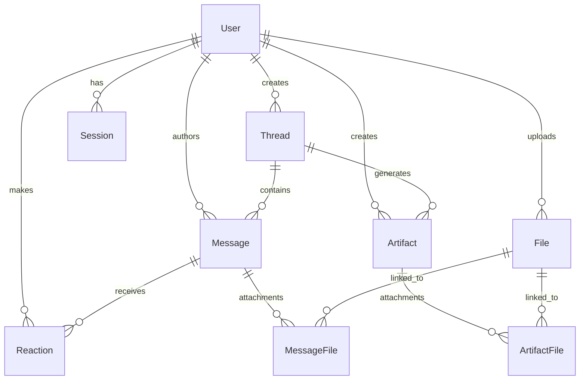

# Experience Layer Backend

A Cloudflare Worker-based microservice implementing the Experience Layer backend for the Chief Potential Officer System. Built with Prisma ORM, D1 database, and modern TypeScript.

## 🏗️ Architecture Overview

This backend implements the **Experience Layer** from the [Experience Layer Documentation](https://rpotential.atlassian.net/wiki/spaces/~712020cfbf91f01fc6437b9e33c2b931ddf177/pages/46661789/Experience+Layer), providing:

- **Thread Management**: Conversation contexts with memory and metadata
- **Message System**: Rich messages with UI blocks and attachments  
- **Artifact Management**: Structured outputs (insights, reports, dashboards)
- **File Handling**: Secure upload/download with previews
- **Authentication**: Google OAuth with role-based access control
- **Real-time Features**: Server-Sent Events for live updates

## 🚀 Quick Start

### Prerequisites
- Node.js and pnpm
- Cloudflare account
- Wrangler CLI

### Development Setup

```bash
# Install dependencies
pnpm install

# Generate Prisma client
npx prisma generate

# Run database migrations (local)
npx wrangler d1 migrations apply prisma-demo-db --local

# Start development server
pnpm dev
```

### Testing the API

```bash
# Health check
curl http://localhost:8787/health

# Create user
curl -X POST http://localhost:8787/users \
  -H "Content-Type: application/json" \
  -d '{"email": "user@example.com", "name": "Test User", "role": "USER"}'

# List users
curl http://localhost:8787/users
```

## 📊 Database Schema

### Core Entities



### Key Features

- **CUID-based IDs** for better performance and security
- **JSON metadata fields** for extensible data storage
- **Proper relationships** with cascade deletes
- **Enum types** for controlled vocabularies
- **Optimized indexes** for query performance

## 🛠️ Technology Stack

- **Runtime**: Cloudflare Workers
- **Database**: Cloudflare D1 (SQLite)
- **ORM**: Prisma with D1 adapter
- **Framework**: Hono (lightweight HTTP framework)
- **Validation**: Zod schemas
- **Language**: TypeScript
- **Package Manager**: pnpm

## 📁 Project Structure

```
src/
├── types/              # TypeScript type definitions
│   ├── api.ts         # API request/response types
│   ├── blocks.ts      # UI blocks system (Slack-compatible)
│   ├── database.ts    # Database entity types
│   └── index.ts       # Type exports
├── utils/             # Utility functions
│   ├── database.ts    # Database helpers & Prisma client
│   ├── validation.ts  # Zod validation schemas
│   └── response.ts    # Response utilities & formatting
├── routes/            # API route handlers (Phase 2)
├── middleware/        # Request middleware (Phase 2)
├── services/          # Business logic services (Phase 2)
├── generated/         # Generated Prisma client
└── index.ts          # Main application entry point
```

## 🔧 API Design

### Response Format

All API responses follow a consistent format:

```json
{
  "success": true,
  "data": { /* response data */ },
  "metadata": {
    "timestamp": "2025-07-11T19:32:54.281Z",
    "correlation_id": "f68268be-9120-4813-bc76-51f3a89c3ea3",
    "version": "1.0"
  }
}
```

### Error Handling

Errors follow RFC 7807 Problem Details format:

```json
{
  "success": false,
  "error": {
    "type": "https://api.rpotential.dev/problems/validation-error",
    "title": "Validation Error",
    "status": 400,
    "detail": "The request contains invalid parameters",
    "errors": { /* field-specific errors */ },
    "timestamp": "2025-07-11T19:32:54.281Z",
    "trace_id": "correlation-id-here"
  }
}
```

## 📋 Implementation Plan

This implementation plan breaks down the Experience Layer Backend development into 8 strategic phases, each building upon the previous one to create a robust, scalable, and production-ready system.

### Phase 1: Database Schema & Core Models ✅ **COMPLETED**

**Objective**: Establish the foundation with a comprehensive database schema and core data models.

**Deliverables**:
- ✅ Enhanced Prisma schema with all Experience Layer entities
- ✅ Database migrations (local & remote deployment)
- ✅ Generated Prisma client with D1 adapter
- ✅ Comprehensive TypeScript type definitions
- ✅ Zod validation schemas for all entities
- ✅ Database utility functions and error handling
- ✅ Basic API infrastructure with Hono framework
- ✅ Health check and basic user endpoints

**Key Components**:
- **Entities**: User, Session, Thread, Message, File, Artifact, Reaction
- **Relationships**: Proper foreign keys with cascade deletes
- **Validation**: Type-safe schemas using Zod
- **Infrastructure**: Database connection, error handling, pagination helpers

### Phase 2: API Architecture & Routing ✅ **COMPLETED**

**Objective**: Build comprehensive REST API endpoints with proper middleware and validation.

**Deliverables**:
- ✅ Complete CRUD operations for all entities
- ✅ Request/response middleware stack (validation, auth, CORS, logging)
- ✅ Input validation and sanitization using Zod schemas
- ✅ Comprehensive error handling with RFC 7807 format
- ✅ Modular routing system with proper path handling
- ✅ Response formatting and status codes
- ✅ Authentication middleware and session management
- [ ] API documentation (OpenAPI/Swagger) - **Planned for Phase 3**

**Implemented API Endpoints**:
```
GET    /health                 # System health check ✅
GET    /api/v1                # API version info ✅
GET    /api/v1/health         # API health check ✅

POST   /api/v1/auth/login     # User authentication ✅
POST   /api/v1/auth/logout    # Session logout ✅
GET    /api/v1/auth/me        # Current user info ✅
GET    /api/v1/auth/sessions  # List user sessions ✅

GET    /api/v1/users          # List users with pagination ✅
GET    /api/v1/users/:id      # Get user profile ✅
POST   /api/v1/users          # Create new user ✅
PUT    /api/v1/users/:id      # Update user profile ✅
DELETE /api/v1/users/:id      # Delete user ✅

GET    /api/v1/threads        # List user threads ✅
POST   /api/v1/threads        # Create new thread ✅
GET    /api/v1/threads/:id    # Get thread details ✅
PUT    /api/v1/threads/:id    # Update thread ✅
DELETE /api/v1/threads/:id    # Delete thread ✅

GET    /api/v1/threads/:id/messages  # List thread messages ✅
POST   /api/v1/threads/:id/messages  # Create new message ✅
GET    /api/v1/messages/:id   # Get message details ✅
PUT    /api/v1/messages/:id   # Edit message ✅
DELETE /api/v1/messages/:id   # Delete message ✅

GET    /api/v1/messages/:id/reactions # Get message reactions ✅
POST   /api/v1/messages/:id/reactions # Add/remove reaction ✅

GET    /api/v1/files          # List files with pagination ✅
GET    /api/v1/files/:id      # Get file details ✅
POST   /api/v1/files          # Create file record ✅
PUT    /api/v1/files/:id      # Update file ✅
DELETE /api/v1/files/:id      # Delete file ✅

GET    /api/v1/artifacts      # List artifacts ✅
GET    /api/v1/threads/:id/artifacts # List thread artifacts ✅
GET    /api/v1/artifacts/:id  # Get artifact details ✅
POST   /api/v1/threads/:id/artifacts # Create artifact ✅
PUT    /api/v1/artifacts/:id  # Update artifact ✅
DELETE /api/v1/artifacts/:id  # Delete artifact ✅

# Legacy endpoints for backward compatibility ✅
GET    /users                 # Legacy users endpoint ✅
POST   /users                 # Legacy user creation ✅
```

**Key Achievements**:
- **Modular Architecture**: Separate route files for each entity with proper organization
- **Validation Middleware**: Comprehensive Zod-based validation for body, query, and path parameters
- **Authentication System**: Token-based authentication with session management
- **Error Handling**: Consistent RFC 7807 error responses with correlation IDs
- **CORS & Security**: Proper CORS configuration and security headers
- **Pagination**: Consistent pagination for list endpoints
- **Database Integration**: Proper Prisma ORM integration with D1 database
- **Type Safety**: Full TypeScript coverage with generated types

**Testing Status**: All endpoints manually tested and working ✅
- Thread creation, listing, and management ✅
- Message creation with user and assistant messages ✅  
- File attachment handling ✅
- User management and authentication ✅
- Error handling and validation ✅

### Phase 3: Testing & Security Hardening 🧪 **NEXT PHASE**

**Objective**: Implement comprehensive testing suite and enhance security features.

**Deliverables**:
- [ ] Unit tests for all API endpoints and middleware
- [ ] Integration tests for database operations
- [ ] End-to-end API testing with real scenarios
- [ ] Security testing and vulnerability assessment
- [ ] Performance testing and benchmarking
- [ ] API documentation (OpenAPI/Swagger)
- [ ] Code coverage analysis and reporting

**Testing Strategy**:
- **Unit Tests**: Individual function and component testing
- **Integration Tests**: Database operations and middleware chains
- **API Tests**: End-to-end request/response validation
- **Security Tests**: Authentication, authorization, input validation
- **Performance Tests**: Load testing and response time validation

**Security Enhancements**:
- [ ] Enhanced authentication flows (Google OAuth integration)
- [ ] JWT token management (access + refresh tokens) 
- [ ] Advanced session management with secure storage
- [ ] Rate limiting and abuse prevention
- [ ] Security headers and enhanced CORS configuration
- [ ] Input sanitization and SQL injection prevention
- [ ] API key management for external integrations
- [ ] Audit logging for security events

### Phase 4: Authentication & OAuth Integration 🔒 **PLANNED**

**Objective**: Implement secure authentication and authorization mechanisms.

**Deliverables**:
- [ ] Google OAuth 2.0 integration
- [ ] JWT token management (access + refresh tokens)
- [ ] Session management with secure storage
- [ ] Role-based access control (RBAC)
- [ ] Rate limiting and abuse prevention
- [ ] Security headers and CORS configuration
- [ ] API key management for external integrations

### Phase 4: Authentication & OAuth Integration 🔒 **PLANNED**

**Objective**: Implement production-ready authentication and authorization mechanisms.

**Deliverables**:
- [ ] Google OAuth 2.0 integration
- [ ] JWT token management (access + refresh tokens)
- [ ] Enhanced session management with secure storage
- [ ] Role-based access control (RBAC) refinements
- [ ] Rate limiting and abuse prevention
- [ ] Security headers and advanced CORS configuration
- [ ] API key management for external integrations
- [ ] Comprehensive audit logging

**Security Features**:
- **Authentication**: Google OAuth with JWT tokens
- **Authorization**: Enhanced role-based permissions (Admin/User)
- **Rate Limiting**: Per-user and per-endpoint limits
- **Data Protection**: Advanced input sanitization and SQL injection prevention
- **Audit Logging**: Comprehensive security events and access logs

### Phase 5: Message System & UI Blocks 💬 **PLANNED**

**Objective**: Implement rich messaging with UI blocks and real-time capabilities.

**Deliverables**:
- [ ] Rich message creation and editing
- [ ] UI blocks system (Slack-compatible)
- [ ] File attachment handling
- [ ] Message reactions system
- [ ] Real-time message updates via SSE
- [ ] Message search and filtering
- [ ] Conversation memory management

**UI Blocks Support**:
- **Text Blocks**: Rich text with markdown support
- **Interactive Blocks**: Buttons, forms, dropdowns
- **Media Blocks**: Images, videos, file previews
- **Layout Blocks**: Sections, dividers, headers
- **Data Blocks**: Tables, charts, key-value displays

### Phase 6: File Management 📁 **PLANNED**

**Objective**: Implement secure file upload, storage, and management system.

**Deliverables**:
- [ ] Secure file upload with validation
- [ ] Cloud storage integration (Cloudflare R2)
- [ ] File preview generation (images, PDFs, documents)
- [ ] Access control and permissions
- [ ] File versioning and metadata
- [ ] Bulk operations and file management
- [ ] Storage optimization and cleanup

**File Features**:
- **Upload**: Direct upload to R2 with signed URLs
- **Validation**: File type, size, and security scanning
- **Previews**: Automatic generation for supported formats
- **Access Control**: Thread-based and user-based permissions
- **Metadata**: Extraction and indexing for search

### Phase 7: Artifacts & Interactive Features 🎯 **PLANNED**

**Objective**: Build structured artifact management with interactive capabilities.

**Deliverables**:
- [ ] Artifact creation and management (insights, reports, dashboards)
- [ ] Interactive action handling
- [ ] Form processing and validation
- [ ] Data visualization components
- [ ] Artifact versioning and history
- [ ] Export capabilities (PDF, JSON, CSV)
- [ ] Collaborative editing features

**Artifact Types**:
- **Insights**: Data analysis and recommendations
- **Reports**: Structured business reports
- **Dashboards**: Interactive data visualizations
- **PDFs**: Generated documents
- **References**: Knowledge base entries

### Phase 8: Real-time & Observability 📡 **PLANNED**

**Objective**: Add real-time capabilities and comprehensive monitoring.

**Deliverables**:
- [ ] Server-Sent Events (SSE) implementation
- [ ] WebSocket fallback for older browsers
- [ ] Comprehensive logging and monitoring
- [ ] Performance metrics and analytics
- [ ] Error tracking and alerting
- [ ] Health checks and status dashboard
- [ ] Distributed tracing

**Real-time Features**:
- **Live Updates**: New messages, reactions, file uploads
- **Presence**: User online/offline status
- **Typing Indicators**: Real-time typing awareness
- **Notifications**: Push notifications for important events

**Observability**:
- **Metrics**: Request latency, error rates, throughput
- **Logs**: Structured logging with correlation IDs
- **Tracing**: End-to-end request tracing
- **Alerts**: Automated incident detection

### Phase 9: Production Readiness 🚀 **PLANNED**

**Objective**: Optimize for production deployment with enterprise-grade features.

**Deliverables**:
- [ ] Performance optimization and caching
- [ ] Automated testing suite (unit, integration, e2e)
- [ ] CI/CD pipeline with automated deployment
- [ ] Documentation and API reference
- [ ] Security audit and penetration testing
- [ ] Backup and disaster recovery
- [ ] Scaling and load testing

**Production Features**:
- **Performance**: Response caching, query optimization, CDN integration
- **Testing**: Comprehensive test coverage with automated execution
- **Deployment**: Blue-green deployments with rollback capabilities
- **Security**: Regular security scans and vulnerability assessments
- **Monitoring**: Production monitoring and alerting
- **Documentation**: Complete API docs, deployment guides, troubleshooting

## 🎯 Success Metrics

### Technical Metrics
- **API Response Time**: < 200ms p95, < 100ms p50
- **Uptime**: 99.9% availability
- **Error Rate**: < 0.1% for 5xx errors
- **Test Coverage**: > 90% code coverage
- **Security**: Zero critical vulnerabilities

### Feature Metrics
- **Real-time Performance**: < 100ms message delivery
- **File Upload**: Support for files up to 100MB
- **Concurrent Users**: Support for 1000+ concurrent connections
- **Data Throughput**: Handle 10,000+ messages per day
- **Storage Efficiency**: Optimized storage with automatic cleanup

## 🔄 Development Workflow

### Phase Transition Criteria
Each phase must meet the following criteria before proceeding:
1. **Functionality**: All planned features implemented and tested
2. **Quality**: Code review passed and tests passing
3. **Performance**: Meets defined performance benchmarks
4. **Security**: Security review completed
5. **Documentation**: Phase documentation updated

### Continuous Integration
- **Code Quality**: ESLint, Prettier, TypeScript strict mode
- **Testing**: Automated test execution on every commit
- **Security**: Dependency vulnerability scanning
- **Performance**: Automated performance regression testing

### Deployment Strategy
- **Local Development**: Hot reload with local D1 database
- **Staging**: Deployed to Cloudflare Workers with staging D1
- **Production**: Blue-green deployment with health checks