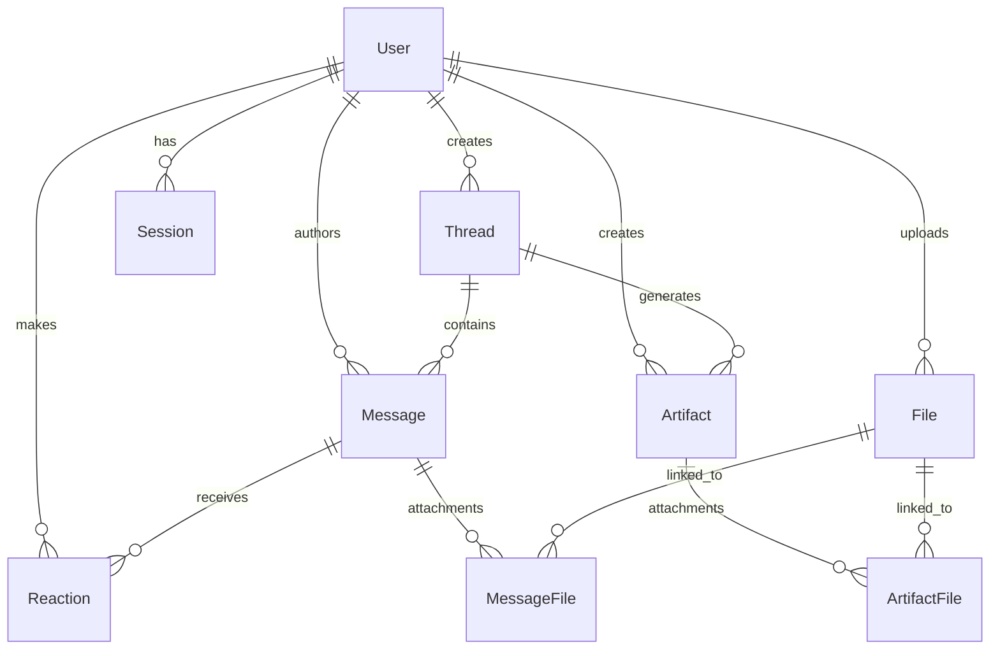

# Experience Layer Backend

A Cloudflare Worker-based microservice implementing the Experience Layer backend for the Chief Potential Officer System. Built with Prisma ORM, D1 database, and modern TypeScript.

## 🏗️ Architecture Overview

This backend implements the **Experience Layer** from the [Experience Layer Documentation](https://rpotential.atlassian.net/wiki/spaces/~712020cfbf91f01fc6437b9e33c2b931ddf177/pages/46661789/Experience+Layer), providing:

- **Thread Management**: Conversation contexts with memory and metadata
- **Message System### Deployment Strategy
- **Local Development**: Hot reload with local D1 database
- **Staging**: Deployed to Cloudflare Workers with staging D1
- **Production**: Blue-green deployment with health checks

## 📊 Logging & Monitoring

### CloudFlare Workers Logs

The project includes convenient npm scripts for monitoring your CloudFlare Worker logs in real-time. These are essential for debugging issues and monitoring application behavior in production.

#### Basic Logging Commands

```bash
# Basic real-time logs
npm run logs

# Pretty formatted logs (recommended for development)
npm run logs:pretty

# JSON formatted logs (useful for log processing)
npm run logs:json
```

#### Filtered Logging

```bash
# Show only errors and failures
npm run logs:errors

# Show only thread-related operations
npm run logs:thread

# Custom grep filtering (example: show POST requests)
npm run logs:grep "POST"
```

#### Debugging Workflow

1. **Start error monitoring** before testing:
   ```bash
   npm run logs:errors
   ```

2. **Test your API endpoint** (e.g., create a thread)

3. **Monitor logs** for detailed error information including:
   - Request payload validation
   - Database operations
   - Error stack traces
   - Correlation IDs for tracing

#### Enhanced Thread Creation Logging

The thread creation endpoint includes detailed logging:
- Request payload inspection
- User ID validation
- Database operation status
- Success/failure confirmation
- Error details with stack traces

#### Example Log Output

```
=== Thread Creation Started ===
Thread data received: {
  "title": "Discussion about AI ethics",
  "description": "A detailed discussion...",
  "userId": "ck9x8v7b600034l5r8jlkf0a1",
  "metadata": { "tags": ["ai", "ethics"], "priority": "high" }
}
User ID: ck9x8v7b600034l5r8jlkf0a1
Thread created successfully: cm7x8v9b200034l5r9jlkf1b2
=== Thread Creation Completed ===
```

#### Production Monitoring

For production environments, consider:
- **Log aggregation**: Collect logs in a centralized system
- **Alerting**: Set up alerts for error patterns
- **Performance metrics**: Monitor response times and throughput
- **Health checks**: Regular endpoint availability monitoring

## 🗄️ Database Schema Management

The Experience Layer Backend includes a comprehensive **multi-entity database schema** designed for modern conversation-based applications with AI integration:

- **User Management**: Complete user profiles and authentication
- **Thread System**: Organized conversations with metadata and context
- **Messaging**: Rich messages with UI blocks and attachments  
- **Artifact Management**: Structured outputs (insights, reports, dashboards)
- **File Handling**: Secure upload/download with previews
- **Authentication**: JWT-based authentication with role-based access control
- **AI Integration**: OpenAI-compatible chat completions with auto-responses
- **Real-time Features**: Server-Sent Events for live updates
- **Completion Analytics**: Token usage tracking and conversation memory

## 🚀 Quick Start

### Prerequisites
- Node.js and pnpm
- Cloudflare account
- Wrangler CLI

### Development Setup

```bash
# Install dependencies
pnpm install

# Generate Prisma client
npx prisma generate

# Run database migrations (local)
npx wrangler d1 migrations apply prisma-demo-db --local

# Start development server
pnpm dev
```

### Testing the API

```bash
# Health check
curl http://localhost:8787/health

# Test JWT authentication (requires valid token)
curl -H "Authorization: Bearer <jwt_token>" \
     http://localhost:8787/api/v1/users/me

# Test with cookie authentication
curl -H "Cookie: rpotential_auth=<jwt_token>" \
     http://localhost:8787/api/v1/auth/verify
```

## 🔐 Authentication System

### JWT-based Authentication

The backend now uses **JWT (JSON Web Token) authentication**. This replaces the previous session-based system with a more scalable and secure approach.

#### Authentication Methods

1. **Cookie Authentication** (Browser requests):
   - Cookie name: `rpotential_auth`
   - Automatically handled by browsers
   - Supports redirect to auth service for unauthenticated requests

2. **Bearer Token Authentication** (API clients):
   - Header: `Authorization: Bearer <jwt_token>`
   - Ideal for API integrations and mobile apps

#### Middleware Functions

- **`authenticateUser`**: Requires valid JWT, returns 401 if not authenticated
- **`optionalAuth`**: Adds user info if authenticated, but continues if not  
- **`authenticateWithRedirect`**: Redirects browser requests to auth service, returns 401 for API requests
- **`requireRole(['ADMIN'])`**: Role-based access control for admin-only endpoints

#### Environment Variables

Required environment variables for JWT authentication:

```bash
# Required: Secret key for JWT verification
JWT_SECRET=your-jwt-secret-key

# Optional: Comma-separated list of allowed domains (defaults to rpotential.ai,globant.com)
ALLOWED_DOMAINS=rpotential.ai,globant.com
```

#### JWT Token Structure

JWT tokens must contain the following claims:

```json
{
  "sub": "user_id",
  "email": "user@example.com", 
  "name": "User Name",
  "domain": "rpotential.ai",
  "role": "USER",
  "exp": 1234567890,
  "iat": 1234567890
}
```

#### Protected Endpoints

All API endpoints require authentication except:
- `/health` - System health check
- `/api/v1` - API version info
- `/api/v1/auth/login` - Legacy login (for backwards compatibility)

Protected endpoints include:
- `/api/v1/users/*` (Admin role required for management operations)
- `/api/v1/threads/*`
- `/api/v1/messages/*`
- `/api/v1/artifacts/*`
- `/api/v1/files/*`
- `/api/v1/reactions/*`

#### Testing Authentication

```bash
# Verify JWT token
curl -H "Authorization: Bearer <jwt_token>" \
     http://localhost:8787/api/v1/auth/verify

# Get current user profile
curl -H "Cookie: rpotential_auth=<jwt_token>" \
     http://localhost:8787/api/v1/users/me

# Unauthenticated request (returns 401)
curl http://localhost:8787/api/v1/users/me
```

For detailed authentication implementation, see: [AUTHENTICATION_INTEGRATION.md](./AUTHENTICATION_INTEGRATION.md)

## 📊 Database Schema

### Core Entities



### Key Features

- **CUID-based IDs** for better performance and security
- **JSON metadata fields** for extensible data storage
- **Proper relationships** with cascade deletes
- **Enum types** for controlled vocabularies
- **Optimized indexes** for query performance

## 🛠️ Technology Stack

- **Runtime**: Cloudflare Workers
- **Database**: Cloudflare D1 (SQLite)
- **ORM**: Prisma with D1 adapter
- **Framework**: Hono (lightweight HTTP framework)
- **Validation**: Zod schemas
- **Language**: TypeScript
- **Package Manager**: pnpm

## 📁 Project Structure

```
src/
├── types/              # TypeScript type definitions
│   ├── api.ts         # API request/response types
│   ├── blocks.ts      # UI blocks system (Slack-compatible)
│   ├── database.ts    # Database entity types
│   └── index.ts       # Type exports
├── utils/             # Utility functions
│   ├── database.ts    # Database helpers & Prisma client
│   ├── validation.ts  # Zod validation schemas
│   └── response.ts    # Response utilities & formatting
├── routes/            # API route handlers (Phase 2)
├── middleware/        # Request middleware (Phase 2)
├── services/          # Business logic services (Phase 2)
├── generated/         # Generated Prisma client
└── index.ts          # Main application entry point
```

## 🔧 API Design

### Response Format

All API responses follow a consistent format:

```json
{
  "success": true,
  "data": { /* response data */ },
  "metadata": {
    "timestamp": "2025-07-11T19:32:54.281Z",
    "correlation_id": "f68268be-9120-4813-bc76-51f3a89c3ea3",
    "version": "1.0"
  }
}
```

### Error Handling

Errors follow RFC 7807 Problem Details format:

```json
{
  "success": false,
  "error": {
    "type": "https://experience.rpotential.dev/problems/validation-error",
    "title": "Validation Error",
    "status": 400,
    "detail": "The request contains invalid parameters",
    "errors": { /* field-specific errors */ },
    "timestamp": "2025-07-11T19:32:54.281Z",
    "trace_id": "correlation-id-here"
  }
}
```

## 📋 Implementation Plan

This implementation plan breaks down the Experience Layer Backend development into 8 strategic phases, each building upon the previous one to create a robust, scalable, and production-ready system.

### Phase 1: Database Schema & Core Models ✅ **COMPLETED**

**Objective**: Establish the foundation with a comprehensive database schema and core data models.

**Deliverables**:
- ✅ Enhanced Prisma schema with all Experience Layer entities
- ✅ Database migrations (local & remote deployment)
- ✅ Generated Prisma client with D1 adapter
- ✅ Comprehensive TypeScript type definitions
- ✅ Zod validation schemas for all entities
- ✅ Database utility functions and error handling
- ✅ Basic API infrastructure with Hono framework
- ✅ Health check and basic user endpoints

**Key Components**:
- **Entities**: User, Session, Thread, Message, File, Artifact, Reaction
- **Relationships**: Proper foreign keys with cascade deletes
- **Validation**: Type-safe schemas using Zod
- **Infrastructure**: Database connection, error handling, pagination helpers

### Phase 2: API Architecture & Routing ✅ **COMPLETED**

**Objective**: Build comprehensive REST API endpoints with proper middleware and validation.

**Deliverables**:
- ✅ Complete CRUD operations for all entities
- ✅ Request/response middleware stack (validation, auth, CORS, logging)
- ✅ Input validation and sanitization using Zod schemas
- ✅ Comprehensive error handling with RFC 7807 format
- ✅ Modular routing system with proper path handling
- ✅ Response formatting and status codes
- ✅ JWT authentication middleware
- ✅ Role-based access control with domain validation
- [ ] API documentation (OpenAPI/Swagger) - **Planned for Phase 3**

**Implemented API Endpoints**:
```
GET    /health                 # System health check ✅
GET    /api/v1                # API version info ✅
GET    /api/v1/health         # API health check ✅

POST   /api/v1/auth/login     # User authentication ✅
POST   /api/v1/auth/logout    # Session logout ✅
GET    /api/v1/auth/me        # Current user info ✅
GET    /api/v1/auth/verify    # JWT token verification ✅
GET    /api/v1/auth/sessions  # List user sessions ✅

GET    /api/v1/users          # List users with pagination ✅
GET    /api/v1/users/:id      # Get user profile ✅
GET    /api/v1/users/me       # Get current user profile (JWT auth) ✅
POST   /api/v1/users          # Create new user ✅
PUT    /api/v1/users/:id      # Update user profile ✅
DELETE /api/v1/users/:id      # Delete user ✅

GET    /api/v1/threads        # List user threads ✅
POST   /api/v1/threads        # Create new thread ✅
GET    /api/v1/threads/:id    # Get thread details ✅
PUT    /api/v1/threads/:id    # Update thread ✅
DELETE /api/v1/threads/:id    # Delete thread ✅

GET    /api/v1/threads/:id/messages  # List thread messages ✅
POST   /api/v1/threads/:id/messages  # Create new message ✅
GET    /api/v1/messages/:id   # Get message details ✅
PUT    /api/v1/messages/:id   # Edit message ✅
DELETE /api/v1/messages/:id   # Delete message ✅

GET    /api/v1/messages/:id/reactions # Get message reactions ✅
POST   /api/v1/messages/:id/reactions # Add/remove reaction ✅

GET    /api/v1/files          # List files with pagination ✅
GET    /api/v1/files/:id      # Get file details ✅
POST   /api/v1/files          # Create file record ✅
PUT    /api/v1/files/:id      # Update file ✅
DELETE /api/v1/files/:id      # Delete file ✅

GET    /api/v1/artifacts      # List artifacts ✅
GET    /api/v1/threads/:id/artifacts # List thread artifacts ✅
GET    /api/v1/artifacts/:id  # Get artifact details ✅
POST   /api/v1/threads/:id/artifacts # Create artifact ✅
PUT    /api/v1/artifacts/:id  # Update artifact ✅
DELETE /api/v1/artifacts/:id  # Delete artifact ✅

# OpenAI-Compatible Completions API ✅
POST   /api/v1/chat/completions      # Create chat completion ✅
GET    /api/v1/models                # List available AI models ✅

# Legacy endpoints for backward compatibility ✅
GET    /users                 # Legacy users endpoint ✅
POST   /users                 # Legacy user creation ✅
```

## 🤖 OpenAI-Compatible Completions API

### Overview

The backend now includes a **fully OpenAI-compatible chat completions API** that allows you to:
- Generate AI responses using OpenAI's models
- Maintain conversation context and memory
- Store completion records for analytics
- Auto-generate assistant responses to user messages

### Key Features

- **🔌 OpenAI Compatible**: Drop-in replacement for OpenAI's `/v1/chat/completions` endpoint
- **🚀 Auto-Completion**: Automatically generate AI responses when users send messages
- **💾 Conversation Memory**: Uses thread history for contextual responses
- **📊 Usage Tracking**: Stores completion records with token usage metrics
- **🎛️ Configurable**: Support for all OpenAI parameters (temperature, max_tokens, etc.)
- **🔄 Streaming Support**: Real-time streaming responses (SSE)
- **🔐 Secure**: JWT authentication required for all completion requests

### Environment Variables

Set these environment variables for full functionality:

```bash
# Required for real AI responses
wrangler secret put OPENAI_API_KEY

# Optional configuration
wrangler secret put DEFAULT_AI_MODEL        # default: "gpt-4o"
wrangler secret put AUTO_COMPLETION_ENABLED # default: "true", set to "false" to disable
```

### API Endpoints

#### POST /api/v1/chat/completions

Create a chat completion with OpenAI-compatible parameters.

**Request:**
```bash
curl -X POST \
  'https://dev-experience.rpotential.dev/api/v1/chat/completions' \
  -H 'Authorization: Bearer YOUR_JWT_TOKEN' \
  -H 'Content-Type: application/json' \
  -d '{
    "model": "gpt-4o",
    "messages": [
      {
        "role": "system",
        "content": "You are a helpful assistant."
      },
      {
        "role": "user", 
        "content": "What is artificial intelligence?"
      }
    ],
    "temperature": 0.7,
    "max_tokens": 1000,
    "stream": false,
    "thread_id": "optional_thread_id"
  }'
```

**Response:**
```json
{
  "id": "chatcmpl-abc123",
  "object": "chat.completion",
  "created": 1677652288,
  "model": "gpt-4o",
  "choices": [
    {
      "index": 0,
      "message": {
        "role": "assistant",
        "content": "Artificial intelligence (AI) refers to..."
      },
      "finish_reason": "stop"
    }
  ],
  "usage": {
    "prompt_tokens": 56,
    "completion_tokens": 31,
    "total_tokens": 87
  }
}
```

**Supported Parameters:**
- `model` (string, optional): AI model to use (default: "gpt-4o")
- `messages` (array, required): Conversation messages
- `temperature` (number, optional): Sampling temperature (0-2)
- `max_tokens` (integer, optional): Maximum tokens to generate
- `top_p` (number, optional): Top-p sampling parameter
- `n` (integer, optional): Number of completions to generate
- `stream` (boolean, optional): Enable streaming responses
- `stop` (string/array, optional): Stop sequences
- `presence_penalty` (number, optional): Presence penalty (-2 to 2)
- `frequency_penalty` (number, optional): Frequency penalty (-2 to 2)
- `logit_bias` (object, optional): Token likelihood modifiers
- `user` (string, optional): User identifier
- `thread_id` (string, optional): Associate with specific thread

#### GET /api/v1/models

List available AI models.

**Request:**
```bash
curl -X GET \
  'https://dev-experience.rpotential.dev/api/v1/models' \
  -H 'Authorization: Bearer YOUR_JWT_TOKEN'
```

**Response:**
```json
{
  "success": true,
  "data": {
    "object": "list",
    "data": [
      {
        "id": "gpt-4o",
        "object": "model",
        "created": 1677649963,
        "owned_by": "openai",
        "context_length": 128000
      },
      {
        "id": "gpt-4o-mini",
        "object": "model", 
        "created": 1677649963,
        "owned_by": "openai",
        "context_length": 128000
      }
    ]
  }
}
```

### Auto-Completion Feature

When users create messages in threads, the system automatically generates AI responses:

#### How it Works

1. **User sends message** → Creates message in thread
2. **System analyzes context** → Gets last 10 messages for conversation history
3. **Generates completion** → Calls OpenAI API with conversation context
4. **Creates assistant message** → Stores AI response as new message
5. **Returns both messages** → User gets their message + AI response

#### API Response with Auto-Completion

When creating a user message, you get both messages back:

**Request:**
```bash
curl -X POST \
  'https://dev-experience.rpotential.dev/api/v1/threads/{threadId}/messages' \
  -H 'Authorization: Bearer YOUR_JWT_TOKEN' \
  -H 'Content-Type: application/json' \
  -d '{
    "role": "USER",
    "content": "What can you tell me about artificial intelligence?"
  }'
```

**Response:**
```json
{
  "success": true,
  "data": {
    "userMessage": {
      "id": "user_message_id",
      "role": "USER",
      "content": "What can you tell me about artificial intelligence?",
      "createdAt": "2025-07-16T19:30:00.000Z",
      "user": {
        "id": "user_id",
        "name": "John Doe",
        "email": "john@example.com"
      }
    },
    "assistantMessage": {
      "id": "assistant_message_id",
      "role": "ASSISTANT", 
      "content": "Artificial intelligence (AI) is a fascinating field...",
      "createdAt": "2025-07-16T19:30:01.000Z",
      "user": null,
      "metadata": {
        "completionId": "completion_record_id",
        "model": "gpt-4o",
        "usage": {
          "prompt_tokens": 25,
          "completion_tokens": 150,
          "total_tokens": 175
        }
      }
    }
  }
}
```

#### Configuration Options

- **Enable/Disable**: Set `AUTO_COMPLETION_ENABLED=false` to disable auto-completion
- **Model Selection**: Use `DEFAULT_AI_MODEL` to set default model (defaults to "gpt-4o")
- **Context Length**: Uses last 10 messages from thread for conversation context
- **Error Handling**: Graceful degradation - if completion fails, user message is still created

### Database Integration

#### Completion Records

All completions are stored in the `completions` table with:
- Full request/response data
- Token usage metrics
- Model information
- Relationships to users, threads, and messages
- Timestamps for analytics

#### Message Metadata

Assistant messages include completion metadata:
```json
{
  "completionId": "completion_record_id",
  "model": "gpt-4o", 
  "usage": {
    "prompt_tokens": 25,
    "completion_tokens": 150,
    "total_tokens": 175
  }
}
```

### Streaming Support

For real-time responses, use `stream: true`:

**Request:**
```bash
curl -X POST \
  'https://dev-experience.rpotential.dev/api/v1/chat/completions' \
  -H 'Authorization: Bearer YOUR_JWT_TOKEN' \
  -H 'Content-Type: application/json' \
  -d '{
    "model": "gpt-4o",
    "messages": [{"role": "user", "content": "Hello!"}],
    "stream": true
  }'
```

**Response (Server-Sent Events):**
```
data: {"id":"chatcmpl-123","object":"chat.completion.chunk","created":1677652288,"model":"gpt-4o","choices":[{"index":0,"delta":{"content":"Hello"},"finish_reason":null}]}

data: {"id":"chatcmpl-123","object":"chat.completion.chunk","created":1677652288,"model":"gpt-4o","choices":[{"index":0,"delta":{"content":"!"},"finish_reason":null}]}

data: {"id":"chatcmpl-123","object":"chat.completion.chunk","created":1677652288,"model":"gpt-4o","choices":[{"index":0,"delta":{},"finish_reason":"stop"}]}

data: [DONE]
```

### Available Models

The system supports all current OpenAI models:

- **GPT-4o** (Default): Latest flagship model with 128K context
- **GPT-4o-mini**: Fast, cost-effective model for simple tasks  
- **o1-preview**: Reasoning model for complex problems
- **o1-mini**: Faster reasoning model
- **GPT-4 Turbo**: Previous generation flagship model
- **GPT-3.5 Turbo**: Legacy model for backwards compatibility

### Error Handling

Comprehensive error handling for:
- **401 Unauthorized**: Missing or invalid JWT token
- **400 Bad Request**: Invalid request parameters or missing required fields
- **429 Rate Limited**: Too many requests (when rate limiting is enabled)
- **502 Bad Gateway**: OpenAI API errors or failures
- **500 Internal Server Error**: Unexpected server errors

### Testing the API

#### Basic Completion Test
```bash
curl -X POST \
  'https://dev-experience.rpotential.dev/api/v1/chat/completions' \
  -H 'Authorization: Bearer YOUR_JWT_TOKEN' \
  -H 'Content-Type: application/json' \
  -d '{
    "model": "gpt-4o-mini",
    "messages": [
      {"role": "user", "content": "Say hello in a creative way"}
    ],
    "temperature": 0.9,
    "max_tokens": 50
  }'
```

#### Auto-Completion Test
```bash
# Create a thread first
THREAD_ID=$(curl -X POST \
  'https://dev-experience.rpotential.dev/api/v1/threads' \
  -H 'Authorization: Bearer YOUR_JWT_TOKEN' \
  -H 'Content-Type: application/json' \
  -d '{"title": "AI Discussion"}' | jq -r '.data.id')

# Send a message (will auto-generate response)
curl -X POST \
  "https://dev-experience.rpotential.dev/api/v1/threads/$THREAD_ID/messages" \
  -H 'Authorization: Bearer YOUR_JWT_TOKEN' \
  -H 'Content-Type: application/json' \
  -d '{
    "role": "USER",
    "content": "Explain machine learning in simple terms"
  }'
```

### Migration Information

The completions feature required a new database table:

**Migration:** `0005_add_completions_table.sql`
- Creates `completions` table with relationships to users, threads, and messages
- Adds unique constraints and indexes for performance
- Supports storing full OpenAI request/response data

To apply the migration:
```bash
npm run db:migrate:apply:local   # For local development
npm run db:migrate:apply:remote  # For production deployment
```
```

**Key Achievements**:
- **Modular Architecture**: Separate route files for each entity with proper organization
- **Validation Middleware**: Comprehensive Zod-based validation for body, query, and path parameters
- **JWT Authentication**: JWT integration with cookie and Bearer token support
- **Domain Validation**: Secure access control with allowed domain verification
- **Role-based Access**: Admin/User role enforcement with middleware
- **Error Handling**: Consistent RFC 7807 error responses with correlation IDs
- **CORS & Security**: Proper CORS configuration and security headers
- **Pagination**: Consistent pagination for list endpoints
- **Database Integration**: Proper Prisma ORM integration with D1 database
- **Type Safety**: Full TypeScript coverage with generated types

**Testing Status**: All endpoints manually tested and working ✅
- Thread creation, listing, and management ✅
- Message creation with user and assistant messages ✅  
- File attachment handling ✅
- User management and authentication ✅
- Error handling and validation ✅

### Phase 3: OpenAI Integration & Auto-Completion 🤖 ✅ **COMPLETED**

**Objective**: Implement OpenAI-compatible chat completions API with automatic response generation.

**Deliverables**:
- ✅ OpenAI-compatible `/api/v1/chat/completions` endpoint
- ✅ Real OpenAI API integration with streaming support
- ✅ Completion record storage and analytics tracking
- ✅ Auto-completion for user messages
- ✅ Available models endpoint (`/api/v1/models`)
- ✅ Conversation context and memory management
- ✅ Token usage tracking and cost monitoring
- ✅ Comprehensive error handling and fallback mechanisms
- ✅ Environment-based configuration for model selection

**Key Features**:
- **OpenAI Compatible**: Drop-in replacement for OpenAI's `/v1/chat/completions` endpoint ✅
- **Auto-Completion**: Automatically generate AI responses when users send messages ✅
- **Conversation Memory**: Uses thread history (last 10 messages) for contextual responses ✅
- **Usage Tracking**: Stores completion records with token usage metrics ✅
- **Streaming Support**: Real-time streaming responses (SSE) ✅
- **Model Management**: Support for all current OpenAI models (GPT-4o, o1, etc.) ✅
- **Configuration**: Environment-based model and feature toggles ✅

**API Endpoints**:
```
POST   /api/v1/chat/completions  # Create chat completion ✅
GET    /api/v1/models            # List available AI models ✅
```

**Database Integration**:
- **Completion Records**: Full request/response storage with relationships ✅
- **Message Metadata**: Assistant messages include completion tracking ✅
- **Token Analytics**: Usage metrics for cost monitoring and optimization ✅

**Auto-Completion Workflow**:
1. User creates message → Stored in thread ✅
2. System analyzes conversation context ✅
3. Generates AI completion using OpenAI API ✅
4. Creates assistant message with completion metadata ✅
5. Returns both user and assistant messages ✅

**Environment Configuration**:
```bash
OPENAI_API_KEY              # Required for real AI responses
DEFAULT_AI_MODEL            # default: "gpt-4o"
AUTO_COMPLETION_ENABLED     # default: "true"
```

### Phase 4: Testing & Security Hardening 🧪 **NEXT PHASE**

**Objective**: Implement comprehensive testing suite and enhance security features.

**Deliverables**:
- [ ] Unit tests for all API endpoints and middleware
- [ ] Integration tests for database operations
- [ ] End-to-end API testing with real scenarios
- [ ] Security testing and vulnerability assessment
- [ ] Performance testing and benchmarking
- [ ] API documentation (OpenAPI/Swagger)
- [ ] Code coverage analysis and reporting

**Testing Strategy**:
- **Unit Tests**: Individual function and component testing
- **Integration Tests**: Database operations and middleware chains
- **API Tests**: End-to-end request/response validation
- **Security Tests**: Authentication, authorization, input validation
- **Performance Tests**: Load testing and response time validation

**Security Enhancements**:
- [ ] Enhanced authentication flows (Google OAuth integration)
- [ ] JWT token management (access + refresh tokens) 
- [ ] Advanced session management with secure storage
- [ ] Rate limiting and abuse prevention
- [ ] Security headers and enhanced CORS configuration
- [ ] Input sanitization and SQL injection prevention
- [ ] API key management for external integrations
- [ ] Audit logging for security events

### Phase 5: Authentication & OAuth Integration 🔒 **PLANNED**

**Objective**: Implement secure authentication and authorization mechanisms.

**Deliverables**:
- [ ] Google OAuth 2.0 integration
- [ ] JWT token management (access + refresh tokens)
- [ ] Session management with secure storage
- [ ] Role-based access control (RBAC)
- [ ] Rate limiting and abuse prevention
- [ ] Security headers and CORS configuration
- [ ] API key management for external integrations

### Phase 5: Authentication & OAuth Integration 🔒 **PARTIALLY COMPLETED**

**Objective**: Implement production-ready authentication and authorization mechanisms.

**Deliverables**:
- ✅ JWT token management
- ✅ Enhanced session management with secure JWT storage
- ✅ Role-based access control (RBAC) with Admin/User roles
- ✅ Domain validation for secure access control
- [ ] Google OAuth 2.0 integration (legacy compatibility)
- [ ] Rate limiting and abuse prevention
- [ ] Security headers and advanced CORS configuration
- [ ] API key management for external integrations
- [ ] Comprehensive audit logging

**Security Features**:
- **Authentication**: JWT-based with cookie and Bearer token support ✅
- **Authorization**: Role-based permissions (Admin/User) ✅
- **Domain Control**: Allowed domain validation (rpotential.ai, globant.com) ✅
- **Rate Limiting**: Per-user and per-endpoint limits (planned)
- **Data Protection**: Advanced input sanitization and SQL injection prevention (planned)
- **Audit Logging**: Comprehensive security events and access logs (planned)

### Phase 6: Message System & UI Blocks 💬 **PLANNED**

**Objective**: Implement rich messaging with UI blocks and real-time capabilities.

**Deliverables**:
- [ ] Rich message creation and editing
- [ ] UI blocks system (Slack-compatible)
- [ ] File attachment handling
- [ ] Message reactions system
- [ ] Real-time message updates via SSE
- [ ] Message search and filtering
- [ ] Conversation memory management

**UI Blocks Support**:
- **Text Blocks**: Rich text with markdown support
- **Interactive Blocks**: Buttons, forms, dropdowns
- **Media Blocks**: Images, videos, file previews
- **Layout Blocks**: Sections, dividers, headers
- **Data Blocks**: Tables, charts, key-value displays

### Phase 7: File Management 📁 **PLANNED**

**Objective**: Implement secure file upload, storage, and management system.

**Deliverables**:
- [ ] Secure file upload with validation
- [ ] Cloud storage integration (Cloudflare R2)
- [ ] File preview generation (images, PDFs, documents)
- [ ] Access control and permissions
- [ ] File versioning and metadata
- [ ] Bulk operations and file management
- [ ] Storage optimization and cleanup

**File Features**:
- **Upload**: Direct upload to R2 with signed URLs
- **Validation**: File type, size, and security scanning
- **Previews**: Automatic generation for supported formats
- **Access Control**: Thread-based and user-based permissions
- **Metadata**: Extraction and indexing for search

### Phase 8: Artifacts & Interactive Features 🎯 **PLANNED**

**Objective**: Build structured artifact management with interactive capabilities.

**Deliverables**:
- [ ] Artifact creation and management (insights, reports, dashboards)
- [ ] Interactive action handling
- [ ] Form processing and validation
- [ ] Data visualization components
- [ ] Artifact versioning and history
- [ ] Export capabilities (PDF, JSON, CSV)
- [ ] Collaborative editing features

**Artifact Types**:
- **Insights**: Data analysis and recommendations
- **Reports**: Structured business reports
- **Dashboards**: Interactive data visualizations
- **PDFs**: Generated documents
- **References**: Knowledge base entries

### Phase 9: Real-time & Observability 📡 **PLANNED**

**Objective**: Add real-time capabilities and comprehensive monitoring.

**Deliverables**:
- [ ] Server-Sent Events (SSE) implementation
- [ ] WebSocket fallback for older browsers
- [ ] Comprehensive logging and monitoring
- [ ] Performance metrics and analytics
- [ ] Error tracking and alerting
- [ ] Health checks and status dashboard
- [ ] Distributed tracing

**Real-time Features**:
- **Live Updates**: New messages, reactions, file uploads
- **Presence**: User online/offline status
- **Typing Indicators**: Real-time typing awareness
- **Notifications**: Push notifications for important events

**Observability**:
- **Metrics**: Request latency, error rates, throughput
- **Logs**: Structured logging with correlation IDs
- **Tracing**: End-to-end request tracing
- **Alerts**: Automated incident detection

### Phase 10: Production Readiness 🚀 **PLANNED**

**Objective**: Optimize for production deployment with enterprise-grade features.

**Deliverables**:
- [ ] Performance optimization and caching
- [ ] Automated testing suite (unit, integration, e2e)
- [ ] CI/CD pipeline with automated deployment
- [ ] Documentation and API reference
- [ ] Security audit and penetration testing
- [ ] Backup and disaster recovery
- [ ] Scaling and load testing

**Production Features**:
- **Performance**: Response caching, query optimization, CDN integration
- **Testing**: Comprehensive test coverage with automated execution
- **Deployment**: Blue-green deployments with rollback capabilities
- **Security**: Regular security scans and vulnerability assessments
- **Monitoring**: Production monitoring and alerting
- **Documentation**: Complete API docs, deployment guides, troubleshooting

## 🎯 Success Metrics

### Technical Metrics
- **API Response Time**: < 200ms p95, < 100ms p50
- **Uptime**: 99.9% availability
- **Error Rate**: < 0.1% for 5xx errors
- **Test Coverage**: > 90% code coverage
- **Security**: Zero critical vulnerabilities

### Feature Metrics
- **Real-time Performance**: < 100ms message delivery
- **File Upload**: Support for files up to 100MB
- **Concurrent Users**: Support for 1000+ concurrent connections
- **Data Throughput**: Handle 10,000+ messages per day
- **Storage Efficiency**: Optimized storage with automatic cleanup

## 🔄 Development Workflow

### Phase Transition Criteria
Each phase must meet the following criteria before proceeding:
1. **Functionality**: All planned features implemented and tested
2. **Quality**: Code review passed and tests passing
3. **Performance**: Meets defined performance benchmarks
4. **Security**: Security review completed
5. **Documentation**: Phase documentation updated

### Continuous Integration
- **Code Quality**: ESLint, Prettier, TypeScript strict mode
- **Testing**: Automated test execution on every commit
- **Security**: Dependency vulnerability scanning
- **Performance**: Automated performance regression testing

### Deployment Strategy
- **Local Development**: Hot reload with local D1 database
- **Staging**: Deployed to Cloudflare Workers with staging D1
- **Production**: Blue-green deployment with health checks

## �️ Database Schema Management

### Modifying the Database Schema

This project uses **Prisma ORM** with **Cloudflare D1** (SQLite) for data persistence. All schema changes are managed through the `prisma/schema.prisma` file.

#### 1. Understanding the Schema File

The schema file defines:
- **Models**: Database tables (User, Thread, Message, etc.)
- **Relationships**: Foreign keys and associations between models
- **Enums**: Controlled vocabularies (UserRole, MessageType, etc.)
- **Indexes**: Performance optimizations
- **Constraints**: Data integrity rules

```prisma
// Example model definition
model User {
  id          String   @id @default(cuid())
  email       String   @unique
  name        String?
  role        UserRole @default(USER)
  createdAt   DateTime @default(now())
  
  // Relationships
  threads     Thread[]
  messages    Message[]
  
  @@map("users")
}
```

#### 2. Making Schema Changes

**Common Schema Modifications:**

1. **Adding a new field to an existing model:**
```prisma
model User {
  id          String   @id @default(cuid())
  email       String   @unique
  name        String?
  // Add new field
  phoneNumber String?  // Optional field
  timezone    String   @default("UTC") // Required field with default
  
  @@map("users")
}
```

2. **Creating a new model:**
```prisma
model Notification {
  id        String   @id @default(cuid())
  title     String
  message   String
  isRead    Boolean  @default(false)
  createdAt DateTime @default(now())
  
  // Foreign key relationship
  userId    String
  user      User     @relation(fields: [userId], references: [id], onDelete: Cascade)
  
  @@map("notifications")
}

// Don't forget to add the relationship to the User model
model User {
  // ... existing fields
  notifications Notification[]
}
```

3. **Adding an enum:**
```prisma
enum NotificationType {
  MESSAGE
  MENTION
  SYSTEM
  
  @@map("notification_types")
}

model Notification {
  // ... other fields
  type NotificationType @default(MESSAGE)
}
```

4. **Adding indexes for performance:**
```prisma
model Message {
  // ... fields
  
  @@index([threadId, createdAt])  // Composite index
  @@index([authorId])             // Single field index
}
```

#### 3. Applying Schema Changes

**Step-by-step workflow:**

1. **Edit the schema file:**
```bash
# Open the schema file in your editor
code prisma/schema.prisma
```

2. **Generate Prisma client** (updates TypeScript types):
```bash
npm run db:generate
```

3. **Create migration files** (generates SQL):
```bash
npm run db:migrate:create
```

4. **Apply migrations locally** (updates local database):
```bash
npm run db:migrate:apply:local
```

5. **Test your changes:**
```bash
npm run dev
npm test
```

6. **Apply to production** (when ready):
```bash
npm run db:migrate:apply:remote
```

#### 4. Migration Workflow Examples

**Example: Adding a user profile picture field**

1. **Update schema:**
```prisma
model User {
  id          String   @id @default(cuid())
  email       String   @unique
  name        String?
  avatarUrl   String?  // <- Add this line
  // ... rest of fields
}
```

2. **Apply changes:**
```bash
npm run db:generate                    # Update TypeScript types
npm run db:migrate:create              # Create migration file
npm run db:migrate:apply:local         # Apply to local DB
npm run dev                            # Test locally
npm run db:migrate:apply:remote        # Deploy to production
```

**Example: Creating a new notification system**

1. **Add to schema:**
```prisma
enum NotificationType {
  MESSAGE
  MENTION
  SYSTEM
  
  @@map("notification_types")
}

model Notification {
  id        String           @id @default(cuid())
  title     String
  message   String
  type      NotificationType @default(MESSAGE)
  isRead    Boolean         @default(false)
  createdAt DateTime        @default(now())
  
  userId    String
  user      User            @relation(fields: [userId], references: [id], onDelete: Cascade)
  
  @@index([userId, isRead])
  @@map("notifications")
}

model User {
  // ... existing fields
  notifications Notification[]
}
```

2. **Apply changes:**
```bash
npm run db:generate && npm run db:migrate:create && npm run db:migrate:apply:local
```

#### 5. Best Practices

**Schema Design:**
- Use descriptive field names (`createdAt` not `created`)
- Always add `@@map("table_name")` for consistent table naming
- Use enums for controlled vocabularies
- Add indexes for frequently queried fields
- Use `onDelete: Cascade` for dependent relationships

**Migration Safety:**
- Always test migrations locally first
- Back up production data before major changes:
  ```bash
  npm run db:backup:create
  npm run db:export:remote
  ```
- Use optional fields (`String?`) when adding new columns to existing tables
- Consider data migration scripts for complex changes

**Development Workflow:**
- Make small, incremental changes
- Test each change thoroughly
- Use descriptive commit messages for schema changes
- Document breaking changes in migration comments

#### 6. Troubleshooting

**Common Issues:**

1. **Migration conflicts:**
```bash
npm run db:migrate:status              # Check migration status
npm run db:fresh:local                 # Reset local DB if needed
```

2. **Type errors after schema changes:**
```bash
npm run db:generate                    # Regenerate Prisma client
```

3. **Production migration failures:**
```bash
npm run db:backup:restore              # Restore from backup if needed
npm run db:migrate:status              # Check what went wrong
```

#### 7. Database Scripts Reference

**Quick Commands:**
```bash
# Development workflow
npm run setup                          # Full setup (first time)
npm run db:fresh:local                 # Clean slate for development
npm run db:tables:local                # See current schema

# Schema changes
npm run db:generate                    # After editing schema.prisma
npm run db:migrate:create              # Generate migration files
npm run db:migrate:apply:local         # Apply to local database

# Production deployment
npm run db:migrate:apply:remote        # Deploy schema changes
npm run db:backup:create               # Create backup first

# Inspection and debugging
npm run db:info                        # Database information
npm run db:migrate:status              # Migration status
npm run db:query:local "SELECT ..."    # Execute SQL queries
```

For more detailed database management options, see: **[DATABASE_SCRIPTS.md](./DATABASE_SCRIPTS.md)**

## �📚 Additional Documentation

- **[Database Management Scripts](./DATABASE_SCRIPTS.md)**: Comprehensive guide to all database management commands and workflows
- **[Authentication Integration Guide](./AUTHENTICATION_INTEGRATION.md)**: Comprehensive guide to JWT authentication implementation
- **[Phase 1 Summary](./PHASE1_SUMMARY.md)**: Database schema and core models implementation
- **[Project Overview](./OVERVIEW.md)**: High-level project architecture and goals