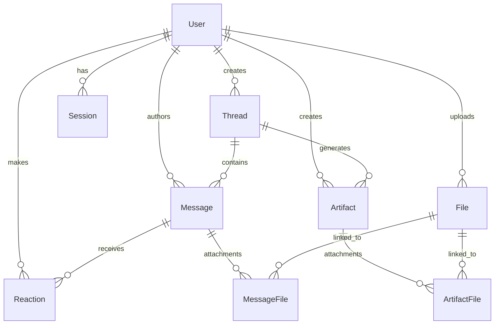

# Experience Layer Backend

A Cloudflare Worker-based microservice implementing the Experience Layer backend for the Chief Potential Officer System. Built with Prisma ORM, D1 database, and modern TypeScript.

## 🏗️ Architecture Overview

This backend implements the **Experience Layer** from the [Experience Layer Documentation](https://rpotential.atlassian.net/wiki/spaces/~712020cfbf91f01fc6437b9e33c2b931ddf177/pages/46661789/Experience+Layer), providing:

- **Thread Management**: Conversation contexts with memory and metadata
- **Message System**: Rich messages with UI blocks and attachments  
- **Artifact Management**: Structured outputs (insights, reports, dashboards)
- **File Handling**: Secure upload/download with previews
- **Authentication**: Google OAuth with role-based access control
- **Real-time Features**: Server-Sent Events for live updates

## 🚀 Quick Start

### Prerequisites
- Node.js and pnpm
- Cloudflare account
- Wrangler CLI

### Development Setup

```bash
# Install dependencies
pnpm install

# Generate Prisma client
npx prisma generate

# Run database migrations (local)
npx wrangler d1 migrations apply prisma-demo-db --local

# Start development server
pnpm dev
```

### Testing the API

```bash
# Health check
curl http://localhost:8787/health

# Create user
curl -X POST http://localhost:8787/users \
  -H "Content-Type: application/json" \
  -d '{"email": "user@example.com", "name": "Test User", "role": "USER"}'

# List users
curl http://localhost:8787/users
```

## 📊 Database Schema

### Core Entities



### Key Features

- **CUID-based IDs** for better performance and security
- **JSON metadata fields** for extensible data storage
- **Proper relationships** with cascade deletes
- **Enum types** for controlled vocabularies
- **Optimized indexes** for query performance

## 🛠️ Technology Stack

- **Runtime**: Cloudflare Workers
- **Database**: Cloudflare D1 (SQLite)
- **ORM**: Prisma with D1 adapter
- **Framework**: Hono (lightweight HTTP framework)
- **Validation**: Zod schemas
- **Language**: TypeScript
- **Package Manager**: pnpm

## 📁 Project Structure

```
src/
├── types/              # TypeScript type definitions
│   ├── api.ts         # API request/response types
│   ├── blocks.ts      # UI blocks system (Slack-compatible)
│   ├── database.ts    # Database entity types
│   └── index.ts       # Type exports
├── utils/             # Utility functions
│   ├── database.ts    # Database helpers & Prisma client
│   ├── validation.ts  # Zod validation schemas
│   └── response.ts    # Response utilities & formatting
├── routes/            # API route handlers (Phase 2)
├── middleware/        # Request middleware (Phase 2)
├── services/          # Business logic services (Phase 2)
├── generated/         # Generated Prisma client
└── index.ts          # Main application entry point
```

## 🔧 API Design

### Response Format

All API responses follow a consistent format:

```json
{
  "success": true,
  "data": { /* response data */ },
  "metadata": {
    "timestamp": "2025-07-11T19:32:54.281Z",
    "correlation_id": "f68268be-9120-4813-bc76-51f3a89c3ea3",
    "version": "1.0"
  }
}
```

### Error Handling

Errors follow RFC 7807 Problem Details format:

```json
{
  "success": false,
  "error": {
    "type": "https://api.rpotential.dev/problems/validation-error",
    "title": "Validation Error",
    "status": 400,
    "detail": "The request contains invalid parameters",
    "errors": { /* field-specific errors */ },
    "timestamp": "2025-07-11T19:32:54.281Z",
    "trace_id": "correlation-id-here"
  }
}
```

## 🎯 Implementation Status

### ✅ Phase 1: Database Schema & Core Models (Complete)
- Enhanced Prisma schema with all entities
- Database migrations (local & remote)
- Comprehensive TypeScript types
- Basic API infrastructure
- Health check and user endpoints

### 🔄 Phase 2: API Architecture & Routing (In Progress)
- Complete REST API endpoints
- Authentication middleware
- Request validation
- Error handling

### ⏳ Phase 3: Authentication & Security (Planned)
- Google OAuth integration
- JWT token management
- Role-based access control
- Rate limiting

### ⏳ Phase 4: Message System & UI Blocks (Planned)
- Rich message creation
- UI blocks rendering
- File attachments
- Real-time updates

### ⏳ Phase 5: File Management (Planned)
- Secure file upload/download
- Preview generation
- Storage optimization

### ⏳ Phase 6: Artifacts & Interactive Features (Planned)
- Artifact management
- Interactive actions
- Form handling

### ⏳ Phase 7: Real-time & Observability (Planned)
- Server-Sent Events
- WebSocket fallback
- Comprehensive logging

### ⏳ Phase 8: Production Readiness (Planned)
- Performance optimization
- Health monitoring
- Documentation

## 🧪 Testing

### Manual Testing

Use the provided curl commands in the Quick Start section to test basic functionality.

### Automated Testing (Planned)

```bash
# Unit tests
pnpm test

# Integration tests
pnpm test:integration

# E2E tests
pnpm test:e2e
```

## 🚀 Deployment

### Local Development

```bash
pnpm dev
```

### Production Deployment

```bash
# Apply remote migrations
npx wrangler d1 migrations apply prisma-demo-db --remote

# Deploy to Cloudflare Workers
pnpm deploy
```

## 📚 Documentation

- [Phase 1 Implementation Summary](./PHASE1_SUMMARY.md)
- [Experience Layer Requirements](https://rpotential.atlassian.net/wiki/spaces/~712020cfbf91f01fc6437b9e33c2b931ddf177/pages/46661789/Experience+Layer)
- [API Documentation](./docs/api.md) (Coming in Phase 2)

## 🤝 Contributing

1. Follow the established patterns for types, validation, and responses
2. Use proper TypeScript types throughout
3. Add appropriate validation schemas for new endpoints
4. Follow the database schema conventions
5. Test locally before deploying

## 🔗 Related Resources

- [Prisma Documentation](https://www.prisma.io/docs)
- [Cloudflare D1 Documentation](https://developers.cloudflare.com/d1/)
- [Hono Framework](https://hono.dev/)
- [Cloudflare Workers](https://developers.cloudflare.com/workers/)

## 2. Initialize Prisma ORM

Note

D1 is supported in Prisma ORM as of [v5.12.0](https://github.com/prisma/prisma/releases/tag/5.12.0).

To set up Prisma ORM, go into your project directory, and install the Prisma CLI:

```sh
cd prisma-d1-example
```

* npm

  ```sh
  npm i -D prisma
  ```

* yarn

  ```sh
  yarn add -D prisma
  ```

* pnpm

  ```sh
  pnpm add -D prisma
  ```

Next, install the Prisma Client package and the driver adapter for D1:

* npm

  ```sh
  npm i @prisma/client @prisma/adapter-d1
  ```

* yarn

  ```sh
  yarn add @prisma/client @prisma/adapter-d1
  ```

* pnpm

  ```sh
  pnpm add @prisma/client @prisma/adapter-d1
  ```

Finally, bootstrap the files required by Prisma ORM using the following command:

* npm

  ```sh
  npx prisma init --datasource-provider sqlite
  ```

* yarn

  ```sh
  yarn prisma init --datasource-provider sqlite
  ```

* pnpm

  ```sh
  pnpm prisma init --datasource-provider sqlite
  ```

The command above:

1. Creates a new directory called `prisma` that contains your [Prisma schema](https://www.prisma.io/docs/orm/prisma-schema/overview) file.
2. Creates a `.env` file used to configure environment variables that will be read by the Prisma CLI.

In this tutorial, you will not need the `.env` file since the connection between Prisma ORM and D1 will happen through a [binding](https://developers.cloudflare.com/workers/runtime-apis/bindings/). The next steps will instruct you through setting up this binding.

Since you will use the [driver adapter](https://www.prisma.io/docs/orm/overview/databases/database-drivers#driver-adapters) feature which is currently in Preview, you need to explicitly enable it via the `previewFeatures` field on the `generator` block.

Open your `schema.prisma` file and adjust the `generator` block to reflect as follows:

```prisma
generator client {
  provider        = "prisma-client-js"
  output          = "../src/generated/prisma"
  previewFeatures = ["driverAdapters"]
}
```

## 3. Create your D1 database

In this step, you will set up your D1 database. You can create a D1 database via the [Cloudflare dashboard](https://dash.cloudflare.com), or via `wrangler`. This tutorial will use the `wrangler` CLI.

Open your terminal and run the following command:

```sh
npx wrangler d1 create prisma-demo-db
```

You should receive the following output on your terminal:

```plaintext
✅ Successfully created DB 'prisma-demo-db' in region WEUR
Created your new D1 database.


{
  "d1_databases": [
    {
      "binding": "DB",
      "database_name": "prisma-demo-db",
      "database_id": "<D1_DATABASE_ID>"
    }
  ]
}
```

You now have a D1 database in your Cloudflare account with a binding to your Cloudflare Worker.

Copy the last part of the command output and paste it into your Wrangler file. It should look similar to this:

* wrangler.jsonc

  ```jsonc
  {
    "name": "prisma-d1-example",
    "main": "src/index.ts",
    "compatibility_date": "2024-03-20",
    "compatibility_flags": [
      "nodejs_compat"
    ],
    "observability": {
      "enabled": true
    },
    "d1_databases": [
      {
        "binding": "DB",
        "database_name": "prisma-demo-db",
        "database_id": "<D1_DATABASE_ID>"
      }
    ]
  }
  ```

* wrangler.toml

  ```toml
  name = "prisma-d1-example"
  main = "src/index.ts"
  compatibility_date = "2024-03-20"
  compatibility_flags = ["nodejs_compat"]
  [observability]
  enabled = true


  [[d1_databases]]
  binding = "DB" # i.e. available in your Worker on env.DB
  database_name = "prisma-demo-db"
  database_id = "<D1_DATABASE_ID>"
  ```

Replace `<D1_DATABASE_ID>` with the database ID of your D1 instance. If you were not able to fetch this ID from the terminal output, you can also find it in the [Cloudflare dashboard](https://dash.cloudflare.com/), or by running `npx wrangler d1 info prisma-demo-db` in your terminal.

Next, you will create a database table in the database to send queries to D1 using Prisma ORM.

## 4. Create a table in the database

[Prisma Migrate](https://www.prisma.io/docs/orm/prisma-migrate/understanding-prisma-migrate/overview) does not support D1 yet, so you cannot follow the default migration workflows using `prisma migrate dev` or `prisma db push`.

Note

Prisma Migrate for D1 is currently in Early Access. If you want to try it out, you can follow the instructions on the [Prisma documentation](https://www.prisma.io/docs/orm/overview/databases/cloudflare-d1#using-prisma-migrate-via-a-driver-adapter-in-prismaconfigts-early-access).

D1 uses [migrations](https://developers.cloudflare.com/d1/reference/migrations) for managing schema changes, and the Prisma CLI can help generate the necessary SQL for those updates. In the steps below, you will use both tools to create and apply a migration to your database.

First, create a new migration using `wrangler`:

```sh
npx wrangler d1 migrations create prisma-demo-db create_user_table
```

Answer `yes` to creating a new folder called `migrations`.

The command has now created a new directory called `migrations` and an empty file called `0001_create_user_table.sql` inside of it:

Next, you need to add the SQL statement that will create a `User` table to that file.

Open the `schema.prisma` file and add the following `User` model to your schema:

```prisma
model User {
  id    Int     @id @default(autoincrement())
  email String  @unique
  name  String?
}
```

Now, run the following command in your terminal to generate the SQL statement that creates a `User` table equivalent to the `User` model above:

```sh
npx prisma migrate diff --from-empty --to-schema-datamodel ./prisma/schema.prisma --script --output migrations/0001_create_user_table.sql
```

This stores a SQL statement to create a new `User` table in your migration file from before, here is what it looks like:

```sql
-- CreateTable
CREATE TABLE "User" (
    "id" INTEGER NOT NULL PRIMARY KEY AUTOINCREMENT,
    "email" TEXT NOT NULL,
    "name" TEXT
);


-- CreateIndex
CREATE UNIQUE INDEX "User_email_key" ON "User"("email");
```

`UNIQUE INDEX` on `email` was created because the `User` model in your Prisma schema is using the [`@unique`](https://www.prisma.io/docs/orm/reference/prisma-schema-reference#unique) attribute on its `email` field.

You now need to use the `wrangler d1 migrations apply` command to send this SQL statement to D1. This command accepts two options:

* `--local`: Executes the statement against a *local* version of D1. This local version of D1 is a SQLite database file that will be located in the `.wrangler/state` directory of your project. Use this approach when you want to develop and test your Worker on your local machine. Refer to [Local development](https://developers.cloudflare.com/d1/best-practices/local-development/) to learn more.
* `--remote`: Executes the statement against your *remote* version of D1. This version is used by your *deployed* Cloudflare Workers. Refer to [Remote development](https://developers.cloudflare.com/d1/best-practices/remote-development/) to learn more.

In this tutorial, you will do both local and remote development. You will test the Worker locally, then deploy your Worker afterwards.

Open your terminal, and run both commands:

```sh
# For the local database
npx wrangler d1 migrations apply prisma-demo-db --local
```

```sh
# For the remote database
npx wrangler d1 migrations apply prisma-demo-db --remote
```

Choose `Yes` both times when you are prompted to confirm that the migration should be applied.

Next, create some data that you can query once the Worker is running. This time, you will run the SQL statement without storing it in a file:

```sh
# For the local database
npx wrangler d1 execute prisma-demo-db --command "INSERT INTO  \"User\" (\"email\", \"name\") VALUES
('jane@prisma.io', 'Jane Doe (Local)');" --local
```

```sh
# For the remote database
npx wrangler d1 execute prisma-demo-db --command "INSERT INTO  \"User\" (\"email\", \"name\") VALUES
('jane@prisma.io', 'Jane Doe (Remote)');" --remote
```

Note

If you receive an error to the effect of `Unknown arguments: (\email\,, \name\)...`, you may need to escape the double quotes with backticks (\`) instead of backslashes (\\).

Your Wrangler command will then look like:

```sh
# Escape with ` instead of \
npx wrangler d1 execute prisma-demo-db --command "INSERT INTO  `"User`" (`"email`", `"name`") VALUES
('jane@prisma.io', 'Jane Doe (Local)');" --<FLAG>
```

## 5. Query your database from the Worker

To query your database from the Worker using Prisma ORM, you need to:

1. Add `DB` to the `Env` interface.
2. Instantiate `PrismaClient` using the `PrismaD1` driver adapter.
3. Send a query using Prisma Client and return the result.

Open `src/index.ts` and replace the entire content with the following:

* JavaScript

  ```js
  import { PrismaClient } from "./generated/prisma/";
  import { PrismaD1 } from "@prisma/adapter-d1";


  export default {
    async fetch(request, env, ctx) {
      const adapter = new PrismaD1(env.DB);
      const prisma = new PrismaClient({ adapter });


      const users = await prisma.user.findMany();
      const result = JSON.stringify(users);
      return new Response(result);
    },
  };
  ```

* TypeScript

  ```ts
  import { PrismaClient } from './generated/prisma/';
  import { PrismaD1 } from '@prisma/adapter-d1';


  export interface Env {
    DB: D1Database;
  }


  export default {
    async fetch(request, env, ctx): Promise<Response> {
      const adapter = new PrismaD1(env.DB);
      const prisma = new PrismaClient({ adapter });


      const users = await prisma.user.findMany();
      const result = JSON.stringify(users);
      return new Response(result);
    },
  } satisfies ExportedHandler<Env>;
  ```

Before running the Worker, generate Prisma Client with the following command:

```sh
npx prisma generate
```

## 6. Run the Worker locally

Now that you have the database query in place and Prisma Client generated, run the Worker locally:

```sh
npm run dev
```

Open your browser at [`http://localhost:8787`](http://localhost:8787/) to check the result of the database query:

```json
[{ "id": 1, "email": "jane@prisma.io", "name": "Jane Doe (Local)" }]
```

## 7. Deploy the Worker

To deploy the Worker, run the following command:

```sh
npm run deploy
```

Access your Worker at `https://prisma-d1-example.USERNAME.workers.dev`. Your browser should display the following data queried from your remote D1 database:

```json
[{ "id": 1, "email": "jane@prisma.io", "name": "Jane Doe (Remote)" }]
```

By finishing this tutorial, you have deployed a Cloudflare Worker using D1 as a database and querying it via Prisma ORM.

## Related resources

* [Prisma documentation](https://www.prisma.io/docs/getting-started).
* To get help, open a new [GitHub Discussion](https://github.com/prisma/prisma/discussions/), or [ask the AI bot in the Prisma docs](https://www.prisma.io/docs).
* [Ready-to-run examples using Prisma ORM](https://github.com/prisma/prisma-examples/).
* Check out the [Prisma community](https://www.prisma.io/community), follow [Prisma on X](https://www.x.com/prisma) and join the [Prisma Discord](https://pris.ly/discord).
* [Developer Experience Redefined: Prisma & Cloudflare Lead the Way to Data DX](https://www.prisma.io/blog/cloudflare-partnership-qerefgvwirjq).

## All Commands in reverse order:

npm run deploy
npm run dev
npx prisma generate
npx wrangler d1 execute prisma-demo-db --command "INSERT INTO  \"User\" (\"email\", \"name\") VALUES
('jane@prisma.io', 'Jane Doe (Remote)');" --remote
npx wrangler d1 execute prisma-demo-db --command "INSERT INTO  \"User\" (\"email\", \"name\") VALUES
('jane@prisma.io', 'Jane Doe (Local)');" --local
npx wrangler d1 migrations apply prisma-demo-db --remote
npx wrangler d1 migrations apply prisma-demo-db --local
npx prisma migrate diff --from-empty --to-schema-datamodel ./prisma/schema.prisma --script --output migrations/0001_create_user_table.sql
npx wrangler d1 migrations create prisma-demo-db create_user_table
npx wrangler d1 create prisma-demo-db
pnpm prisma init --datasource-provider sqlite
pnpm add @prisma/client @prisma/adapter-d1
pnpm add -D prisma

## To update the DB Schema:

Change prisma/schema.prisma

# Create migration file

npx wrangler d1 migrations --from-empty create prisma-demo-db add_nick

# Populate migration file

npx prisma migrate diff --from-local-d1 --to-schema-datamodel ./prisma/schema.prisma --script --output migrations/0002_add_nick.sql

# Apply latest migration

npx wrangler d1 migrations apply prisma-demo-db --local

# Update prisma generated files

npx prisma generate